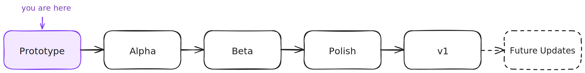

# Roadmap

Volley! ships in six milestones. Each milestone is the state the game is in at the end of that phase, not a list of features.

## Prototype

Done when someone who's never heard of the game plays for an afternoon and comes away wanting more.

## Alpha

Done when the pre-break arc could stand on its own and feel complete.

## Beta

Done when the story the game tells can be felt end to end.

## Polish

Done when nothing about it feels thin.

## v1

Done when you'd put your name on it and tell people to play.

## Future Updates

The game expands with its audience.

---

For active tickets and day-to-day work, see the [GitHub issues](https://github.com/shuck-dev/volley/issues).
