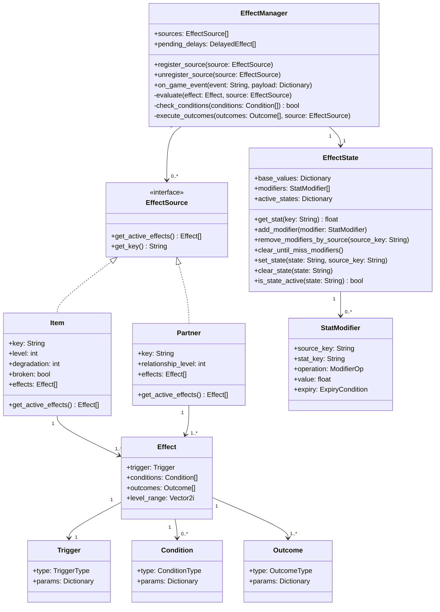
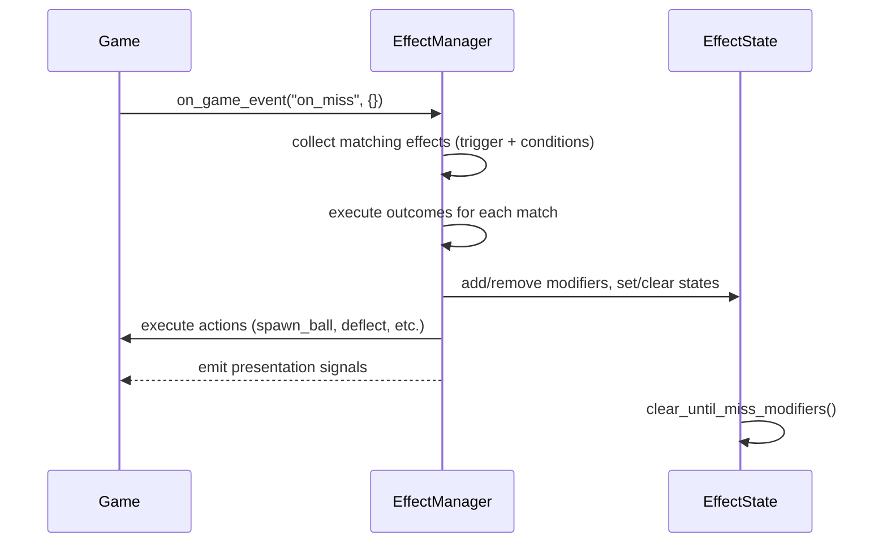
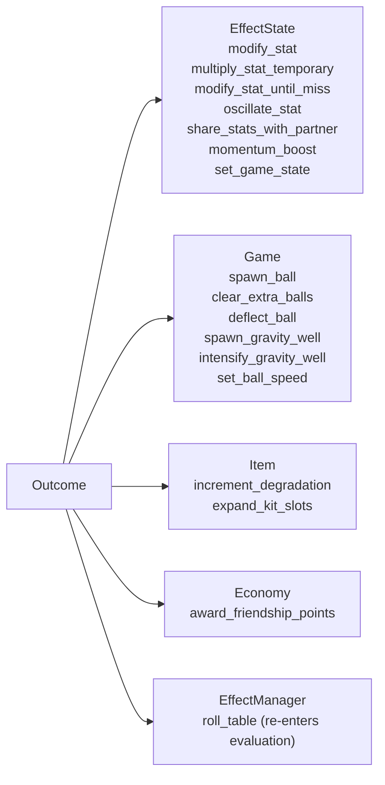
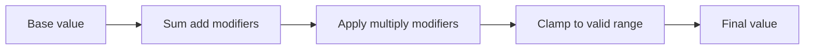
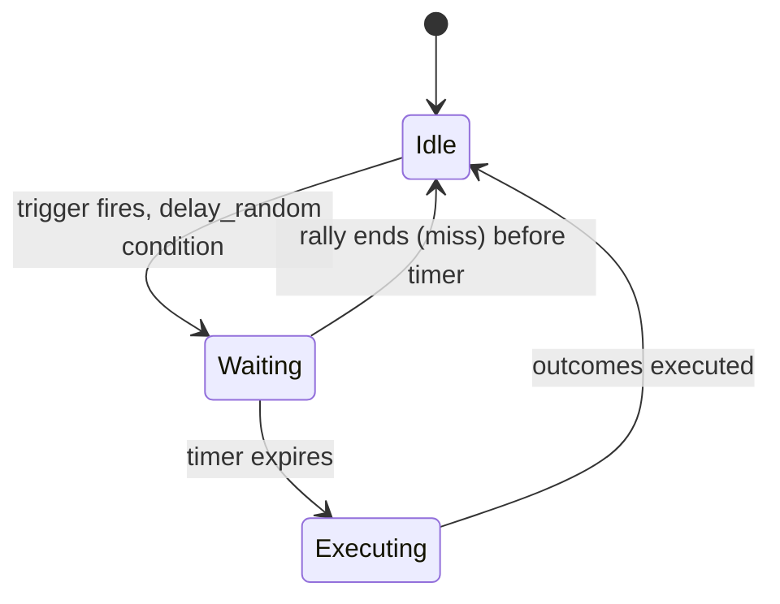
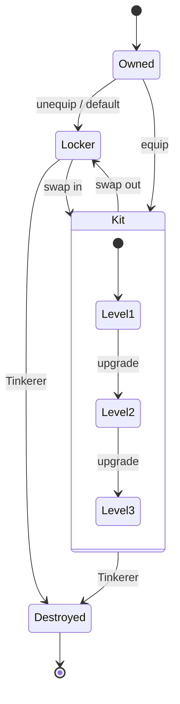
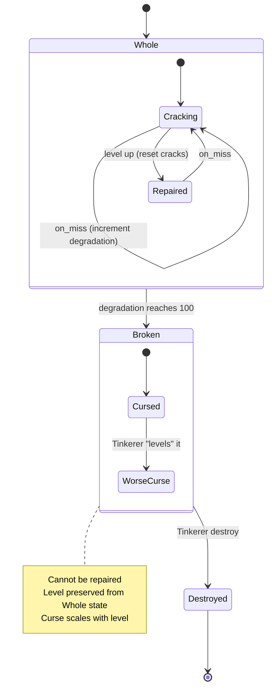
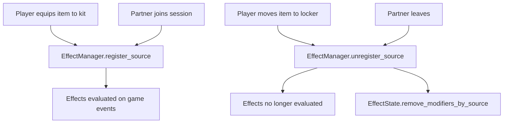
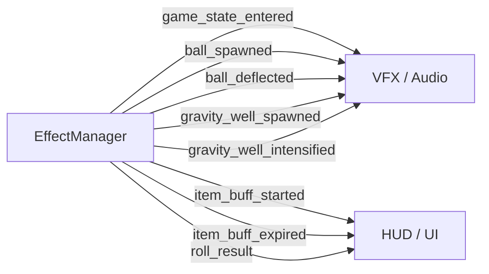
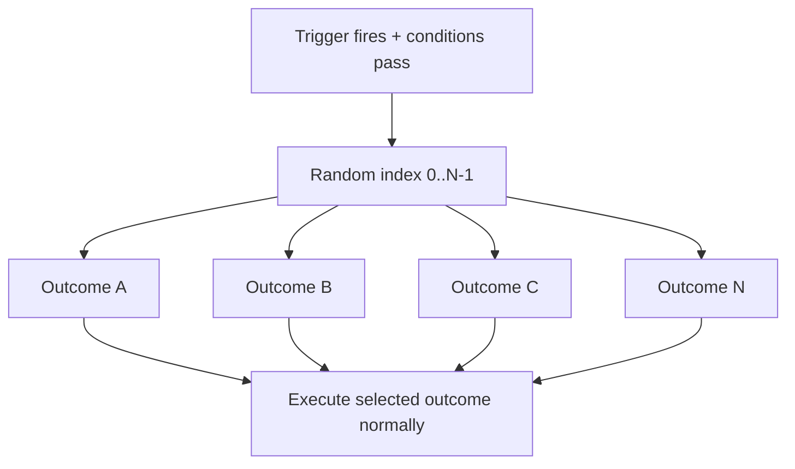

# Effect System Class Design

Technical design for the unified effect framework. All gameplay modifiers (items, partners, future sources) flow through one system.

---

## Core principle

Effects are data, not code. No per-item scripts. Every effect is a combination of trigger + conditions + outcomes defined in resources. The evaluation loop is centralized. Adding a new item means adding data, not writing a new class.

---

## Class diagram



---

## Enums

### TriggerType

```
always
on_miss
on_hit
on_personal_best
on_streak_start
on_streak_multiple
on_streak_milestone
on_edge_hit
on_max_speed_reached
on_ball_behind_paddle
```

### ConditionType

```
game_state_is
game_state_is_not
delay_random
degradation_at
```

### OutcomeType

```
modify_stat
modify_stat_until_miss
multiply_stat_temporary
spawn_ball
clear_extra_balls
set_game_state
deflect_ball
spawn_gravity_well
intensify_gravity_well
award_friendship_points
expand_kit_slots
increment_degradation
share_stats_with_partner
momentum_boost
oscillate_stat
roll_table
set_ball_speed
```

### ModifierOp

```
add
multiply
```

### ExpiryCondition

```
while_owned          # removed when source unequipped/destroyed
duration             # timer, removed after N seconds
until_miss           # cleared on next miss, stackable
until_state_exits    # cleared when a named game state ends
until_next_trigger   # cleared when the same effect fires again
```

---

## Evaluation flow

### Event to outcome



### Outcome routing

Each outcome type routes to a different system. EffectManager handles the dispatch.



---

## Stat resolution



`EffectState.get_stat(key)` is called every frame or on-demand by game systems. The game never reads raw base values directly. All gameplay code queries EffectState.

**Resolution order matters.** Additive modifiers apply first, then multiplicative. This means a +50 add and a x2 multiply on a base of 500 gives (500 + 50) * 2 = 1100, not 500 * 2 + 50 = 1050.

### Prototype stat keys

EffectState is key-agnostic. Game systems register base values at startup. New keys can be added without touching EffectState. The prototype uses:

| Key | Base value | Unit | Registered by |
|---|---|---|---|
| `paddle_speed` | 500.0 | px/s | Paddle |
| `paddle_size` | 50.0 | px | Paddle |
| `ball_speed_min` | 500.0 | px/s | Ball |
| `ball_speed_max_range` | 600.0 | px/s | Ball |
| `ball_speed_increment` | 15.0 | px/s | Ball |
| `friendship_points_per_hit` | 1 | FP | Game |
| `ball_magnetism` | 0.0 | force | Paddle |
| `return_angle_influence` | 0.0 | factor (0-1) | Ball |

### Prototype named states

| State | Set by | Meaning |
|---|---|---|
| `frenzy` | The Stray | Multi-ball chaos mode, speed doubled, ends on miss |

---

## Delayed effects

Some conditions introduce a delay between trigger and outcome (e.g. `delay_random`).



`EffectManager` holds a list of `DelayedEffect` entries. Each tick, it decrements timers. If the invalidation event fires (e.g. miss) before the timer expires, the delayed effect is discarded.

---

## Item lifecycle

Standard items have a simple lifecycle. Degrading items (Seven Years) have an extended one.

### Standard item



### Degrading item (Seven Years)



---

## Effect source registration



Court items register on purchase and stay registered unless lockered or destroyed. Kit items register/unregister on swap.

---

## Signal emission

EffectManager emits signals after executing outcomes. Presentation layer subscribes to these, never to the raw game events.



All signals include `item_key` so consumers can differentiate sources without knowing the effect system internals.

---

## Oscillation model

`oscillate_stat` is a continuous effect, not event-driven. EffectManager ticks it every frame.

```
value = base + amplitude * sin(time * frequency + phase_offset)
```

Frequency and phase offset are randomized per effect instance so oscillation feels unpredictable, not rhythmic. Amplitude scales with item level. The oscillation modifies the stat through EffectState like any other modifier, but the value updates every frame.

---

## Roll table resolution

`roll_table` picks one outcome from an equally weighted set and executes it. The roll is a single random selection, not sequential evaluation.



"Long Shot Pays" is a special outcome that re-executes all other positive outcomes in the table. Implementation: the outcome stores references to the other entries and calls `execute_outcomes` for each.

---

## Godot integration

| Class | Godot type | Location |
|---|---|---|
| `EffectManager` | Autoload (Node) | `res://systems/effect_manager.gd` |
| `EffectState` | Autoload (Node) | `res://systems/effect_state.gd` |
| `Effect` | Resource | `res://data/effects/` |
| `Item` | Resource | `res://data/items/` |
| `Partner` | Resource | `res://data/partners/` |
| `Trigger` | Resource (inner) | Inline in Effect resource |
| `Condition` | Resource (inner) | Inline in Effect resource |
| `Outcome` | Resource (inner) | Inline in Effect resource |
| `StatModifier` | RefCounted | Created at runtime by EffectManager |

Effects, items, and partners are `.tres` resource files. Authored in data, loaded at runtime. No per-item scripts.

---

## Notes

- `EffectManager` subscribes to game signals (`ball_missed`, `paddle_hit`, `streak_changed`, etc.) and translates them into `on_game_event` calls with the matching TriggerType.
- `always` trigger effects are evaluated once on registration and re-evaluated when the source changes (level up, degradation change).
- Court items call `register_source` on purchase automatically. Kit items call it on equip.
- `EffectState.get_stat()` is the single source of truth for all gameplay values. Game systems must never hardcode stats.
- Degradation is tracked per-item instance, not in EffectManager. The item exposes its degradation state; EffectManager just increments it when the outcome fires.
- Partner effects use the same Effect resources. The only difference is the source: `Partner` provides effects scaled by `relationship_level` instead of `item.level`.
