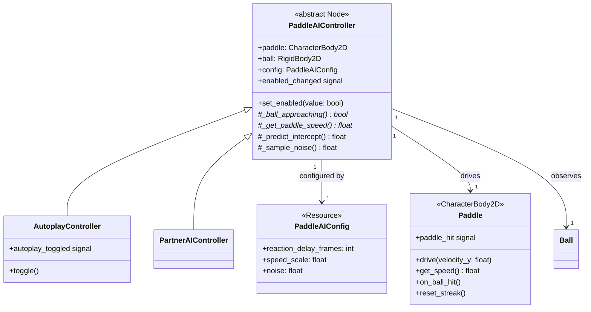
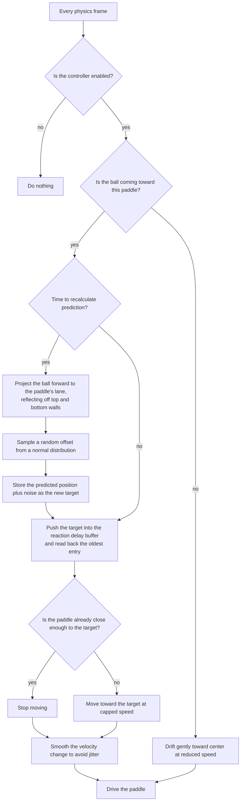

# Partner AI

## Goal

Design a shared AI controller interface that both autoplay and partner AI extend from, with an improved tracking algorithm and editor-configurable tuning. The design should be extensible enough that future partners or AI modes can override behaviour without forking the codebase.

**Points:** Spike
**Dependencies:** Autoplay Controller (existing AI reference), Ball Scaling (speed curve), First Partner Unlock (partner paddle contract)

## Context

The current `AutoplayController` drives the player paddle during idle mode. It uses a reaction-delay ring buffer, speed-capped tracking, and center drift. The partner AI (from `11-first-partner-unlock.md`) needs the same capabilities but with different tuning and lifecycle: always active, no player toggle, separate config.

Both systems share the same core problem: given a ball and a paddle, decide how to move the paddle each frame. The differences are in configuration (speed scale, reaction delay, smoothing) and lifecycle (toggle vs always-on). This makes them natural candidates for a shared base with configuration-driven behaviour.

**Current numbers:**
- Paddle base speed: 500 px/s
- Ball speed: 400 (min) to 700 (min + 300 range), +15 px/s per hit
- Arena height: 986 px
- Autoplay config: 12 reaction frames, 0.75 speed scale, 0.1 smoothing, 0.3 drift scale

## Research: pong AI techniques

Standard pong AI falls into three tiers of sophistication.

### Tier 1: Simple tracking (current approach)

The paddle chases the ball's current y-position (or a delayed version of it). This is what the autoplay controller does today. It works at low speeds but degrades predictably: the paddle always moves in the same way, and misses are always "arrived late." No visual variety in how the AI plays.

**Strengths:** Simple, cheap, easy to tune.
**Weaknesses:** Robotic feel. No variety in miss patterns. Doesn't handle wall bounces well because it doesn't know they're coming.

### Tier 2: Predictive interception

The AI projects the ball's trajectory forward, reflecting off top/bottom walls, until it crosses the paddle's x-position. The predicted y-intercept becomes the target. This is the standard "good" pong AI used in most commercial implementations.

**Strengths:** Handles wall bounces correctly. The AI moves to the right place early rather than chasing. Looks smarter and more human because humans predict bounces too.
**Weaknesses:** Perfect prediction looks robotic in a different way: the paddle goes to the exact pixel and waits. Needs imperfection layered on top.

### Tier 3: Prediction + noise (recommended)

Combine predictive interception with configurable imperfection:

- **Target noise:** Add a random offset (normal distribution) to the predicted intercept point. The AI aims for "roughly the right spot." Tuning the standard deviation controls skill level.
- **Recalculation interval:** The AI only recomputes its prediction every N frames. Between recalculations it moves toward the old target. This creates natural-looking overshoots and corrections.
- **Speed cap + smoothing:** Same as tier 1, layered on top.

**Strengths:** Visually convincing. Miss variety: sometimes the AI is slightly off position, sometimes heading the wrong way, sometimes just too slow. Each miss looks different.
**Weaknesses:** More parameters to tune. But those parameters map directly to "personality" knobs, which is exactly what we want for partners.

### Shadow ball variant (considered, rejected)

Spawn an invisible ball with a slightly different speed. The AI tracks the shadow instead. Over time speed drift creates natural prediction errors. Elegant but one parameter controls everything, which doesn't give enough per-partner tuning surface.

**Decision:** Use tier 3 (prediction + noise). It gives the most tuning surface for partner personality and produces the best-looking misses. The prediction step is cheap: linear motion with wall reflections, no complex physics.

## Class diagram

| Class | Role |
|---|---|
| `PaddleAIConfig` | Shared tuning resource. Different `.tres` instances for autoplay vs partner. No separate config type for autoplay. |
| `PaddleAIController` | Abstract base defining the AI contract. Owns the shared algorithm (prediction, reaction delay, noise, tracking, drift). Not instantiated directly. Subclasses override virtual methods marked `*` to specify direction, speed source, and center position. |
| `AutoplayController` | Player idle mode. Adds toggle mechanic and input handling. Ball approaching = leftward. Speed source = paddle's upgraded speed via `ItemManager.get_stat()`. |
| `PartnerAIController` | Partner character. Always enabled, no additional state. Ball approaching = rightward. Speed source = unupgraded base via `ItemManager.get_base_stat()`. |
| `Paddle` | Existing paddle class. Both controllers call `drive(velocity_y)` to move it each frame. |

---

## Interface: `PaddleAIController`

Abstract base class (GDScript has no formal interfaces). Defines the contract via virtual methods; owns the shared algorithm because both subclasses use the same prediction, tracking, and drift logic with different config values.

### Override points

| Method | Purpose | Autoplay | Partner |
|---|---|---|---|
| `_ball_approaching()` | Which direction counts as "coming toward me" | `ball.velocity.x < 0` | `ball.velocity.x > 0` |
| `_get_paddle_speed()` | Movement speed ceiling | `paddle.get_speed()` (upgraded via ItemManager) | `ItemManager.get_base_stat("paddle_speed")` (unupgraded base from GameRules) |
| `_predict_intercept()` | Ball trajectory prediction | Default (linear + wall reflect) | Default (or override for curve-aware) |
| `_sample_noise()` | Noise distribution on target | Default (normal distribution) | Default (or override for biased) |

Center drift target is fixed at `0.0` (court center) for all subclasses. Not a virtual method.

### Per-frame decision flow

The prediction is a single linear projection with a wall-reflection loop. Computationally trivial for pong geometry.

### Why reaction delay on predicted targets (not raw position)

The current autoplay delays the raw ball y-position. The improved algorithm delays the predicted intercept instead. This layers two kinds of imperfection: noise creates spatial error (wrong spot), delay creates temporal error (stale decision). Both compound naturally as ball speed increases.

## Config resource: `PaddleAIConfig`

A single shared resource type for both autoplay and partner AI. Different `.tres` instances hold different values. Three fields, each with a distinct and significant impact on gameplay feel.

### Fields

| Field | Type | Range | What it controls |
|---|---|---|---|
| `reaction_delay_frames` | int | 1-30 | Frames of latency between seeing the ball and reacting. The primary miss driver at high speeds: the AI tracks a stale position, and the cost of that staleness grows with ball speed. |
| `speed_scale` | float | 0.0-1.0 | Movement speed as a fraction of paddle speed. Determines the physical ceiling: which balls are reachable and which aren't. |
| `noise` | float | 0.0-120.0 | Standard deviation (pixels) of random offset on the predicted intercept. 0 = perfect aim. 20 = occasional paddle-width errors. 60+ = frequent visible errors. Normal distribution, so most predictions cluster near the real target. |

Everything else is an internal implementation detail with sensible fixed values:
- **Velocity smoothing:** Fixed lerp factor (0.08). Prevents jitter without being a tuning knob. If it needs to change, it changes in code, not per-config.
- **Center drift:** Fixed at 25% of tracking speed with gentle smoothing. Affects the paddle when the ball is on the other side of the court. The player isn't watching.
- **Snap threshold:** Fixed at 8 px. Technical detail to prevent oscillation. Below visual detection.
- **Prediction recalculation:** Every frame, but noise is sampled once per prediction and held until the next recalculation of the intercept point (i.e. when the ball changes direction after a wall bounce or paddle hit). This means the AI commits to a slightly wrong position for the duration of a ball flight, producing visible "wrong spot" misses. Re-sampling noise every frame would average out and produce no visible error.

### Autoplay preset

Maps to current `AutoPlayConfig` behaviour. `noise = 0.0` means the autoplay predicts perfectly; accuracy is limited only by speed cap and reaction delay.

| Field | Value |
|---|---|
| `reaction_delay_frames` | 12 |
| `speed_scale` | 0.75 |
| `noise` | 0.0 |

`friendship_point_rate` moves out of the AI system entirely during migration. It's a game economy value that belongs on `game.gd` or `ProgressionConfig`, not on any AI controller or config resource. See the `AutoplayController` subclass section for details.

### Tuning guide

| Value | Turn up to... | Turn down to... |
|---|---|---|
| `reaction_delay_frames` | More sluggish, more misses at speed | Snappier reactions |
| `speed_scale` | Fewer "too slow" misses | More misses on fast crosses |
| `noise` | Sloppier aim, more "wrong spot" misses | More precise targeting |

The key insight: **reaction delay and speed cap create "too slow" misses** (heading the right way, can't keep up). **Noise creates "wrong spot" misses** (went to the wrong place). A good partner has both kinds. A pure tracker (noise = 0) only ever has "too slow" misses, which gets visually repetitive.

## Subclasses

### `AutoplayController`

Adds toggle mechanic, input check for `toggle_autoplay` action, `autoplay_toggled` signal, disables paddle `_physics_process` when active.

Overrides:
- `_ball_approaching()`: `ball.linear_velocity.x < 0`
- `_get_paddle_speed()`: `paddle.get_speed()` (upgraded via ItemManager)

`friendship_point_rate` does not belong on the controller. It's a game economy value: `game.gd` already decides the FP multiplier based on autoplay state. The rate should live on `game.gd` (or `ProgressionConfig` alongside other economy thresholds). The controller's only economy responsibility is emitting `autoplay_toggled` so `game.gd` knows which rate to apply. This is a cleanup from the current `AutoPlayConfig` which bundled AI tuning and economy values in the same resource.

### `PartnerAIController`

Always enabled from `_ready()`. No additional state, no toggle, no input handling.

Overrides:
- `_ball_approaching()`: `ball.linear_velocity.x > 0`
- `_get_paddle_speed()`: `ItemManager.get_base_stat(&"paddle_speed")` (unupgraded base from GameRules)

The partner's speed ceiling comes from the same stat system as the player's, just without item modifiers applied. If a future partner effect needs to change partner speed, it flows through the effect system.

## Migration from current `AutoplayController`

1. Create `PaddleAIConfig` resource and `PaddleAIController` abstract base class.
2. Rewrite `AutoplayController` as a thin subclass (toggle, input, direction overrides).
3. Remove `AutoPlayConfig` class. Create `autoplay_config.tres` as a `PaddleAIConfig` instance with current values + `noise = 0`.
4. Move `friendship_point_rate` from `AutoPlayConfig` to `game.gd` (or `ProgressionConfig`). `game.gd` already owns the FP accumulation logic; it just needs to own the rate constant too.
5. Update `game.gd`: replace `autoplay_config: AutoPlayConfig` export with reading config from the controller directly.

With noise = 0 and interval = 1, the prediction reduces to equivalent behaviour to today for straight-line ball paths, and is strictly better (handles wall bounces) for angled paths. The autoplay will be slightly more competent at returning wall bounces than it is today. If this needs to be preserved exactly, a `prediction_interval_frames = 0` sentinel could fall back to raw position tracking.

Existing tests should pass because the algorithm's outputs are the same when prediction collapses to direct tracking.

## Partner miss philosophy

The core tension: before a partner, the right wall returns the ball 100% of the time. A partner misses sometimes. From the player's perspective, the partner is strictly worse at returning balls. The partner must always feel like a net positive, moment to moment, not just in the math.

Two principles guide the miss design:

### Principle 1: The partner is never the bottleneck

The partner should be tuned so they almost never miss at speeds the player can comfortably handle. At the point where the partner starts failing, the ball should be fast enough that the player is also struggling or would have missed shortly after. The streak ends because it got hard for both of them, not because the partner let the player down.

Each partner's config values should be tuned so their miss threshold overlaps with the player's difficulty curve at the stage of the game where that partner is active. A partner's effects (FP bonuses, streak protection, etc.) should make them a clear net positive even when their misses cap the streak lower than the wall would.

### Principle 2: Stat sharing scales partners with the player

As the player upgrades their own stats, partners would fall behind without a way to share those gains. Stat-sharing court items (using the existing `share_stats_with_partner` outcome type) let the player's upgrades lift the active partner too. They apply to whichever partner is active, so no partner becomes obsolete when a new one is recruited.

**Why stat sharing, not partner-specific upgrades:** Partner-specific upgrades don't transfer. When the player recruits a new partner, those upgrades are wasted. Stat sharing means every investment in the player's own stats also invests in every future partner. The progression feels like "we're getting better together."

Stat sharing uses court items (purchased once, always active, no kit slot). They live in the shop rotation and are subject to existing discovery floor rules. This is a mid-to-late game system: early partners are tuned to work at base game speeds without it. Later partners, who arrive when the player's paddle is heavily upgraded, rely on existing sharing items to keep pace from the moment they're recruited.

### How misses happen

Misses come from three compounding factors in the AI:

| Factor | What it produces |
|---|---|
| Reaction delay | "Too late" misses: the partner is heading the right way but acting on stale information. Cost grows with ball speed. |
| Speed cap | "Too slow" misses: the partner can't cross the court fast enough after a wall bounce. Most visually convincing miss type. |
| Prediction noise | "Wrong spot" misses: the partner aimed slightly off. Creates miss variety that pure tracking can't produce. |

**Autoplay** (noise = 0) only produces "too late" and "too slow" misses: monotonous but acceptable for a background system.

**Partners** (noise > 0) produce all three types. Each miss looks different, which sells the illusion of a person.

All three factors scale naturally with ball speed. The AI algorithm is unchanged regardless of stat sharing or upgrades; only the input stats shift.

### Why this works for idle play

In idle mode (autoplay + partner), both AI systems have similar limitations at a given upgrade level. Neither is dramatically worse than the other: they fail at similar speeds and the game ticks along naturally. The player returns to good news (FP earned, streak progress) regardless of whose miss ended a rally.

## Extensibility

**Partner personalities:** Each partner gets their own `.tres` config instance. A nervous partner has high noise and fast reactions (jittery, inaccurate). A calm partner has low noise and slower reactions (smooth, reliable). Three knobs, meaningfully different feel.

**Override hooks:** A future partner could override `_predict_intercept()` (shadow ball variant, curve awareness) or `_sample_noise()` (biased distribution that favours missing in one direction). The base provides good defaults; subclasses replace individual pieces.

## Design notes

**Prediction and item effects:** The prediction assumes constant velocity from the current frame. Cadence's speed oscillation changes ball speed mid-flight, which means the predicted intercept drifts as the ball accelerates or decelerates. This is tolerable because the prediction recalculates every frame and oscillation is gradual, not sudden: the AI corrects as the ball's speed shifts. Items that change ball *direction* mid-flight (curve, gravity wells) would be a harder problem, but those effects are brief and the AI's reaction delay already means it copes imperfectly with sudden changes, which is the desired behaviour.

**Partner speed ceiling:** The partner reads `ItemManager.get_base_stat(&"paddle_speed")` as its baseline. Stat-sharing court items modify this through the effect system using `share_stats_with_partner`.

**Make Fun pass testing:** Test each partner's config with their effects active, not in isolation. The effective miss penalty may be lower than the raw miss rate suggests depending on the partner's effects. Each partner should feel fair at the speeds the player encounters when that partner is typically active.
