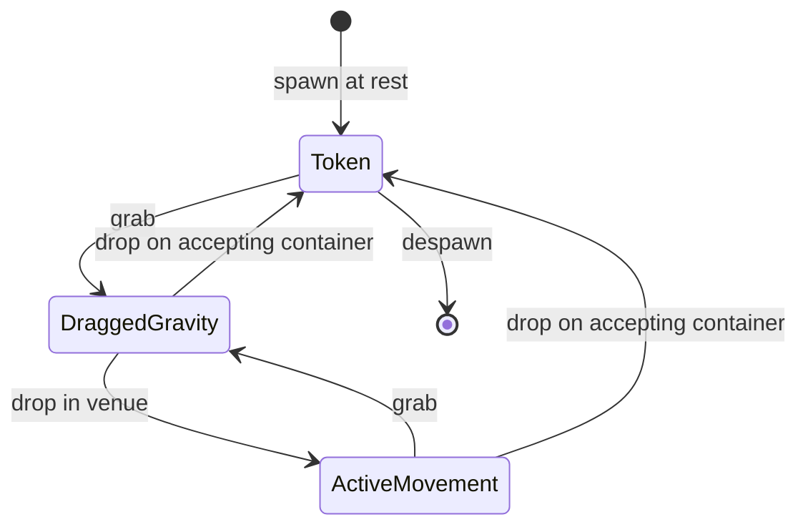
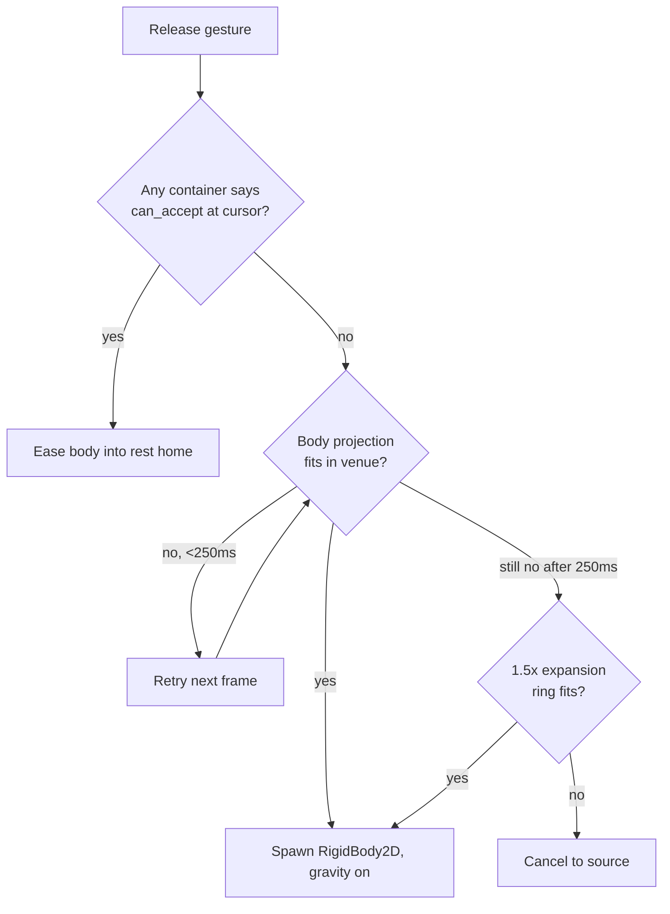

# Equip-Loop Regime

Adversarial review of the homes-and-loose model proposed for item movement across the venue. The aim is to settle the regime before another impl round commits to a moving target. The model under challenge sits in [21-ball-dynamics.md](21-ball-dynamics.md) under "Containers and the swap pattern"; this doc steel-mans it, attacks it, names where it breaks, sketches alternatives, and lands a recommendation.

**Points:** Spike
**Surfaced by:** Bedtime Story churn around Challenge #403, three rounds of impl chasing an unspecified design.

---

## The model under challenge

Restated cleanly so the attack has a clear target.

Every item has a **rest home** and an **active home**. The rest home is the slot in a container (rack, shop, workshop). The active home is the place the item does its job: court for ball-role items, paddle for equipment, fixture marker for fixtures. The court is one active home among several, not a catch-all release destination.

A drag is a non-physics preview. The held token is a `Node2D` riding the cursor; no body, no collisions, no solver cost. Three states bracket it: **token** at rest in a container, **dragged-gravity** during the gesture, **active-movement** when an item is loose in the venue or on the court. A release into a valid home eases the body into that home. A release into the venue but outside any home spawns the item as a `RigidBody2D` with gravity on, the body falls, the body lands, the body stays. The player can grab a loose item with the same gesture they grab a live ball. Fixed venue spots (fixture markers, character positions) anchor specific items and characters.

The starter ball stops being a scene-authored fixture and becomes an owned item with a rest home in the rack, replacing the ad-hoc adoption SH-262 had to do.

### State machine

### Home detection on release

Effects are out of scope for this regime. Effects are owned by the effect-manager subsystem, which has its own rules for application, duration, and stacking. The drag-and-drop regime moves physical items (balls, equipment, fixtures); the effect manager moves effects. The two systems compose at the point of application but do not share the home-and-loose model.

## Steel-man

The strongest case for this model is that it collapses several special cases into one rule. A ball, an equipment item, and a fixture each look the same to the drag controller: pick up, preview, ask containers for accept, drop into the first that says yes, otherwise let physics own it. The court stops being a privileged target and becomes one of several owners with its own `can_accept`. Stray balls already work this way in the prototype; the model just generalises what is already true for one class to every class.

Diegesis is the second pillar, and it is uncompromising: every item in the regime is diegetic, with no exceptions. A held thing is a thing in the world. It went somewhere. If no slot took it, the world keeps it where the player left it. Teleport-restore on invalid release is the alternative, and teleport-restore is the move every shop UI does because it does not have a venue to fall into. Volley has a venue. The model uses the venue, for everything.

The third pillar is that the cost has already been paid. The body projection (`intersect_shape` against the at-rest collision shape at the candidate position) prevents bodies from spawning inside walls or partners. The container summary already exists. The drag flow is already symmetric across item classes by design. What is missing is the one rule that says **what happens when no container takes the drop**, and "loose physics body in the venue" answers that question with the same vocabulary the rest of the model already speaks.

## Steel-man of the opposing position

The court-as-default position: the venue is not a stockroom. A ball released anywhere except a slot belongs on the court, because the only thing a player does with a ball is play with it. Equipment released anywhere except a slot belongs back where it came from, because equipment off the paddle has no semantic. Fixtures released anywhere except their fixture marker are a category error; fixtures are placed, not held. Loose-in-venue is a clever uniformity that buys nothing the player asked for and costs floor clutter, save shape, performance, and a tidy affordance the player now has to learn.

The simpler rule: every item has a rest home and an active home, and an invalid release goes to whichever is more recent. No third state. No physics for items that are not currently doing their job. The drag controller's job is to find a home; if it cannot, it returns the item, and the gesture ends.

This position is not weak. It is what most games do, and the reason is that most games do not benefit from a venue that holds ambient objects.

---

## Adversarial questions

### 1. Does loose-in-venue make the game better, or just add clutter?

Clutter **is** the point. A ball lying on the venue floor reads as "the player left it there", and that is the diegetic argument for the model: the world keeps what the player puts down, and tidying is the player's job. Volley's venues are the rally surface plus a small amount of surrounding space, and a venue that quietly accumulates the player's toys is the cosy register the game wants. The chore of putting your toys away is a feature, not a failure mode.

Equipment and fixtures get the same treatment. A paddle dropped on the floor is a paddle on the floor; a fixture released in the venue rests where it landed. The diegetic principle does not carve out classes of items. Every item the player can hold is an item the world can keep.

### 2. What happens at save / load? Does state grow unbounded?

The save shape persists each loose item's position and `linear_velocity`. Restore is the same as the rally case in [21-ball-dynamics.md](21-ball-dynamics.md): reconstruct at persisted state, advance physics from there.

In practice the count never grows large enough to stress the save shape. The player has a small inventory by design, and the venue is not a shop floor. The "thousand rounds, hundred loose balls" worry is moot at the scales Volley actually plays at.

### 3. Performance: how many loose physics bodies before the solver chokes?

Box2D in Godot 4 sleeps bodies that have been at rest for ~0.5 s. A sleeping body costs roughly nothing per tick. The solver's working set is awake bodies, not total bodies. The risk case is a transient where many loose items are shoved at once (a ball rolls into a stack), which spikes awake count for a frame or two; this is fine for the game's pacing.

The player will never have enough items in play for floor clutter or solver load to become an issue. The cap is the player's inventory, not an engine limit.

### 4. Tidy-up affordance, or drift?

The tidy affordance is the existing drag. A loose item is grabbed and dropped on its rest home the same way any item is, so "putting your toys away" is the same gesture the player already uses for every other interaction. The game does not need a dedicated tidy button, because tidy is not a separate verb; it is the gesture the player already knows, applied to a thing on the floor. This is the diegetic argument: the player has to put their toys away, and the world gives them exactly the tools to do it.

### 5. Effect items: what does loose mean?

Out of scope. Effects are owned by the effect manager, which has its own rules for application, duration, and stacking. The home-and-loose regime does not model effects; a release that would "drop an effect" is a UI category that the effect manager handles in its own terms, not by spawning a body in the venue.

### 6. Drag-and-drop precision: how forgiving is home-detection?

The body-projection rule already handles wall-edge cases for the court. For the rack and shop, slot acceptance is a bounds check inflated by a forgiveness margin (rough budget: half a slot's width). The held token's hover feedback (slight lift, modulation, scale bump) tells the player which positions accept. A "near miss" on a rack that lands inside the forgiveness margin snaps to the slot. A miss outside the margin is loose.

The forgiveness margin is a tuning surface. Too generous and the player feels they cannot place an item loose deliberately; too tight and minor cursor jitter throws the item on the floor. Calibrate against the smallest authored rack slot.

### 7. Loose state across venue leaps?

The narrative says venue leaps are diegetic transitions, not save/load events. Loose items in V1 do not appear in V2; the leap is a fresh venue with its own ambient state. Each venue serialises its own loose items and restores them on return. This is one extra dimension on the save shape, no other model change.

### 8. Does the rack become optional once loose-in-venue is the default?

Only as a failure case, not a default. The rack is the canonical home for any ball not currently in play, and the rack is faster to read (the count is visible at a glance). Loose-in-venue is the **failure case** for an invalid release, not the default state. The rack is the convenient option; loose is the option that exists because the world is a world.

### 9. Released-ball case: does loose-but-not-in-play feel coherent?

This is the question that earns the model. A ball that has rolled off the court is the canonical loose case, and it is already coherent: the rally moved the ball, the ball left the rally, the ball is on the floor, the player picks it up and serves it again. A ball **released** loose by the player (drag from rack, release on the venue floor) reads the same way: the player chose not to put the ball into play right now, and the world honours that choice.

The risk is that the player releases a ball loose by accident, missing the court, and reads the result as an error. The fix is the hover feedback at release: the held token communicates which position will go to court, which to rack, and which is loose, and the player's release is informed.

### 10. How does serving work when the player can grab a loose ball?

The hopper is the canonical serve mechanism. A ball loaded into the hopper exits with a controlled, gentle initial velocity tuned for a clean serve, every time. The hopper is what the player uses when they want to play.

A player-served ball (grab a loose ball, throw it onto the court) gets its initial momentum entirely from the throw gesture. There is no serve-shaping under the hood; the velocity vector at release is the velocity vector the ball carries. This opens a comedic fail state: an over-thrown serve smacks the player character on the rebound and knocks them over. The lesson the venue teaches is "serve gently, or use the hopper", and either resolution is a valid play style. The fail state is funny rather than punishing, which matches the cosy register; the fix is to throw softer next time, or to load the next ball into the hopper.

### 11. Is "court is just a ball-application state" actually true?

Mostly. The court owns ball-role items in active-movement. Partner paddle position is owned by the partner, not the court. Miss zones are court geometry, not ball state. Ball physics material is a property of the court's `PhysicsMaterial`, applied at collision time. The leak the question worries about is: when the court owns the ball's physics material, the court is more than a state. True, but the leak is small. The court is **a state plus a small amount of context** (the wall geometry, the physics material, the spawn rules). That is the same shape every container has: a state plus context.

The honest answer is that the court is not radically symmetric with the rack; the court has more behaviour. The model's claim is that the **drag controller's view** of the court is symmetric with its view of any other container. The controller asks `can_accept`, hands off the body, and forgets. What the court does internally is its own concern. This is the level of symmetry the model needs.

---

## Failure modes

### Body projection holes for moving obstacles

The drop validation uses `intersect_shape` against current geometry. If a partner is mid-stride and the projection sees the partner's collision body at frame N but the partner has moved by frame N+1, the body could spawn inside the partner anyway. The model's defence is the projection runs every physics frame on the held position, not on mouse-up; a release lands the first frame the projection passes. But if no frame passes (the partner is dancing across the only valid spot), the gesture stays open indefinitely. The player feels the held thing is sticky.

The fix is a small expansion ring around the projection shape during release: if the strict projection fails for more than ~250 ms, retry with a 1.5x scaled shape. If that still fails, the gesture cancels back to the source. This trades model purity for player tolerance. The trade is cheap.

### Over-thrown serve hits the player

The hopper is the safe serve. A player-thrown ball carries the player's release velocity directly, and a hard throw can rebound off a wall or the net and clip the character, knocking them over. This is intended (it is the comedic feedback that teaches the gentle-serve lesson), but the failure mode is a player who experiences it as a bug. The defence is the hopper: the hopper is always available, always gentle, and the obvious choice once the player has been knocked over once. The fall animation reads as comedy, not punishment, and recovery is fast.

---

## Alternatives

### Alternative A: court-as-default, no loose state

Every release inside the venue but outside a recognised home goes to the court at the nearest valid play point. No loose floor balls, no third state, no body projection on the venue floor. Equipment off-paddle returns to its rack. Fixtures off-marker return to their rack. Balls off-court go to court.

**Trade-offs.** Simpler model, smaller save shape, no clutter risk. Loses the diegetic feel of "the world keeps what you left there", which is the whole point of the proposed model. Loses the symmetry with stray balls; strays still need a treatment, and now they are the special case the model does not handle. The starter ball still gets owned-as-item, which was the original SH-262 driver. This alternative is the conservative ship.

### Alternative B: physics always, no Node2D held state

Drop the held-as-`Node2D` step. The body spawns as a `RigidBody2D` immediately on grab, with gravity off and a per-frame steer toward the cursor. Release is just the steer turning off. The body always has a physical existence; the only difference between held, loose, and active is which forces and rules are applied to it.

**Trade-offs.** Physically pure: one body type, one lifecycle, no swap pattern. The grab feels heavier (the body has weight even in the air; the cursor is dragging a thing, not previewing one), which might match Volley's tactile aim. Costs solver work during the drag (the steer is a constraint solve every frame, multiplied by held items, which is rarely more than one but adds up if a future feature allows multi-grab). Costs the freedom to make the held visual cheaper or more stylised than the body (the held thing IS the body, so it has to look like the body). Forces the body-projection rule to run continuously during the gesture rather than only at release, which is more solver work.

This alternative is the radical ship. It is more coherent than the proposed model on one axis (body identity is constant) and less coherent on another (held is not preview, the player is fighting solver state during the gesture).

---

## Recommendation

Ship the model as proposed in [21-ball-dynamics.md](21-ball-dynamics.md), with two scoped amendments:

1. Loose state applies to every diegetic item in the regime: balls, equipment, fixtures. Effects are out of scope, owned by the effect manager.
2. Body projection on release uses an expansion-ring fallback after a short hold, then cancels to source if even the expanded shape fails.

The hopper is the canonical serve. Player throws are honest physics, with two cases. A throw of a ball at rest takes its launch velocity from the player's release gesture, capped at a max speed so the player cannot game friendship by chaining hard throws on rest balls. A throw of a ball that is already live (mid-rally grab) preserves the friendship and speed the rally has built; the gesture chooses direction only, magnitude stays from the rally. Same rule as the existing grab-and-release. An over-throw on a rest ball smacks the character into a comedic fall. The player learns to serve gently, or uses the hopper. Both are valid.

The model is the right shape because the venue is part of the game's character, not just a backdrop. Volley's cosy register earns the loose-in-venue rule; the floor that quietly holds the player's toys is the diegetic argument, and tidying is the player's job. A less ambient game would not earn this. The amendments narrow the model only at the seam where another subsystem (the effect manager) already owns the work.
