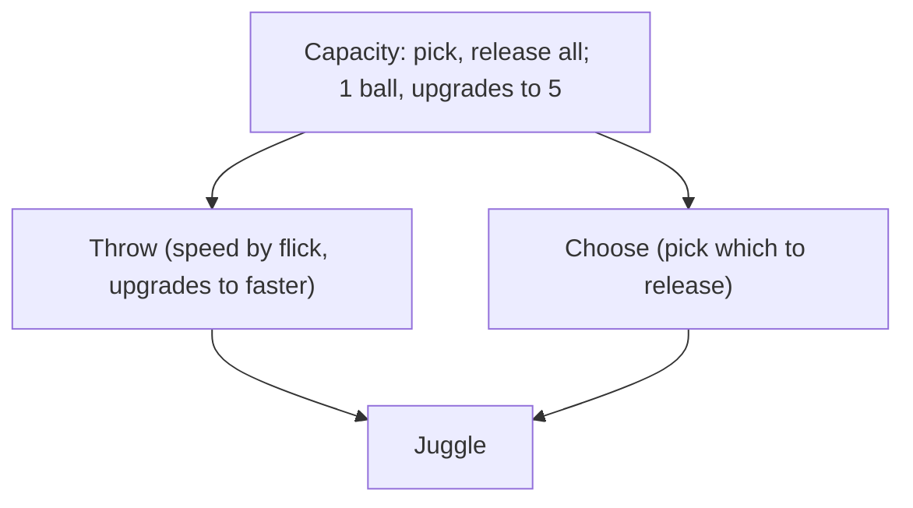

# Starter Items

The player begins with an old ball. The ball shop carries 5 ball items and Pluck (cursor gear).

## Economy

Each hit banks 1 soul immediately and increments the burst counter. On consolidation, the burst counter releases as a burst, scaled by the ball's release multiplier. The burst counter resets on miss; already-banked soul from hits is safe.

Balls are not unique. Duplicates work identically to the first copy. All duplicates cost 2× per copy. First rotation is a mix of standard balls like tennis, baseball, golf.

| Ball | Base cost | Tier |
|---|---|---|
| Old ball | Free | |
| Standard ball | 10 | Common |
| Goop | 80 | Scarce |
| Comeback | 100 | Scarce |
| Cadence | 100 | Rare |
| Cheater | 120 | Rare |
| Pluck | 60 | Unique |

Pluck is unique, one purchase.

| Tier | Restock | Balls |
|---|---|---|
| Common | 50% | Standard ball |
| Scarce | 20% | Goop, Comeback |
| Rare | 5% | Cadence, Cheater |

Old ball always shows. Within a tier, balls split the pool equally.

## Ball upgrade model

Each ball levels up by accumulating consolidations across all rallies. A consolidation is one tier completion.

| Parameter | Default | Description |
|---|---|---|
| `hits_to_consolidation` | 10 | Paddle hits to fill a tier band (global) |
| `consolidations_to_l2` | 5 | Consolidations before L2 unlocks (per ball) |
| `consolidations_to_l3` | 10 | Cumulative total needed for L3 (per ball) |
| `consolidation_release_multiplier` | 1.0 | Soul release = accumulated × multiplier (per ball) |

`hits_to_consolidation` is one global number. `consolidations_to_l2` and `consolidations_to_l3` are per-ball tunable; stronger balls gate behind higher counts. `consolidation_release_multiplier` tunes the release reward independently. Five consolidations per level is the starter default. Each ball tracks `accumulated_soul` as a runtime counter, reset on consolidation release or miss.

## Stock refresh

Button on the ball shop. Re-rolls which balls are available in the shop. Introduced after the shop is cleared. First refresh is free; subsequent refreshes scale with the base cost of the balls currently in rotation.

---

## Old ball

Role: ball
Default starter. No effects.

## Standard ball (tennis, baseball, golf etc)

Role: ball

Soul burst amount is random per ball.

- L1: baseline rally. Hit, miss, consolidate.
- L2: bonus soul on consolidation.
- L3: bigger consolidation soul burst.

Most balls grant some consolidation soul.

## Goop

Role: ball
Zach found it under the floorboards.

- L1: at consolidation splits in two. Collide to merge for a soul burst.
- L2: each consolidation splits one more.
- L3: only the original merges; the rest fold into it.

Not merging before consolidation is a missed bonus, no penalty.

## Comeback

Role: ball
Worn felt ball from an old toybox.

- L1: balls curve toward where you reach.
- L2: once per consolidation, a ball that would miss semicircles around you. One save per consolidation. More balls on court means more chances to miss; the save is a safety net, not a guarantee.
- L3: save shared with partner; can be spent on their miss or yours. You don't choose which. Two players, one save; more court pressure thins it further.

## Cheater

Role: ball
Shifting weights inside, doesn't fly true.

| L | Trigger | Frequency | Reward |
|---|---|---|---|
| L1 | Wobble, random interval. Small lateral nudge off straight line | Most hits | Small bonus per hit |
| L2 | Lurch, every 3-5 hits. Lateral physics push | ~1 in 4 hits | Medium bonus per hit |
| L3 | Mad dash, every 15s | 3s burst | Large soul burst |

## Cadence

Role: ball

| L | Trigger | Frequency | Reward |
|---|---|---|---|
| L1 | Steady speed rhythm, rises and falls | ~half of hits | Base bonus per hit |
| L2 | Rhythm is erratic | Most hits | Increased bonus per hit |
| L3 | Surge, every 15s | 5s activation | Large soul burst on hits during surge |

Sister to Cheater. Both teach reading an unpredictable ball: Cheater through spatial deception, Cadence through tempo deception.

## Pluck

Role: cursor gear
Zach's glove, worn by the cursor.

---

## Mechanic coverage

| Item        | Mechanic |
|-------------|----------|
| Standard ball | Rally loop (hit, miss, consolidate) |
| Goop        | Multi-ball management, merging |
| Comeback    | Positioning shapes ball path |
| Cheater     | Reading the ball in flight, unpredictability |
| Cadence     | Reading tempo, rhythm disruption |
| Pluck       | Manual ball handling |

## Removed

Helmet, Friendship bracelet; old starter equipment. Move to future shop.
Magnetism repurposed into Comeback. Cadence repurposed from equipment into ball.
