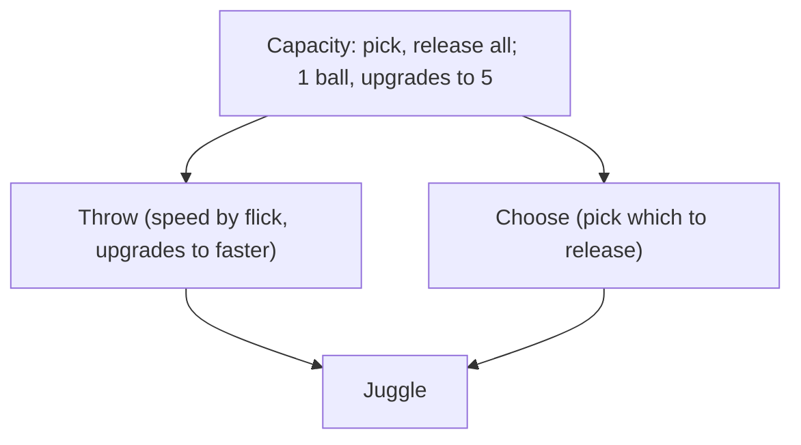

# Starter Items

The player begins with up to 5 ball items and Pluck (cursor gear). These are the initial shop inventory, not owned at start. No other shop categories exist; this is the ball shop.

## Shortfall

Current starter is one ball (base_ball) with a passive `ball_speed_min` stat.
No mechanic is taught. The player never notices the effect.

## Economy

Each hit generates 1 soul. Soul persists through misses. Level costs use the
existing formula (base_cost × 1.6^level) via the Tinkerer.

| Ball | Base cost | Duplicate cost |
|---|---|---|
| Tennis ball | Free | Default ball, always on court |
| Goop | 80 | 2× per copy |
| Comeback | 100 | 2× per copy |
| Cadence | 100 | 2× per copy |
| Cheater | 120 | 2× per copy |
| Pluck | 60 | Unique, purchased once |

Balls are not unique. Each duplicate costs base_cost × 2^copies_owned.
Pluck is unique, one purchase.

## Stock refresh

Button on the ball rack. Re-rolls which balls are available in the shop.
Pool is the 5 starter balls + Pluck. No random generation. First refresh is free
and teaches: you can change what's available.

---

## Tennis ball

Role: ball
Scuffed, already on the court.

- L1: baseline rally. Hit, miss, consolidate.
- L2: bonus soul on consolidation.
- L3: bigger consolidation soul burst.

Most balls grant some consolidation soul. Tennis ball is the simplest expression of it.

## Goop

Role: ball
Zach found it under the floorboards.

- L1: at consolidation splits in two. Collide to merge for a soul burst.
- L2: each consolidation splits one more.
- L3: only the original merges; the rest fold into it.

Not merging is a missed bonus, no penalty.

## Comeback

Role: ball
Worn felt ball from an old toybox.

- L1: balls curve toward where you reach.
- L2: once per consolidation, a ball that would miss semicircles around you. One save per cycle.
- L3: save shared with partner; can be spent on their miss before yours. You don't choose which.

## Cheater

Role: ball
Shifting weights inside, doesn't fly true.

| L | Trigger | Frequency | Reward |
|---|---|---|---|
| L1 | Wobble, always on. Sine curve off straight line | Every hit | Small bonus per hit |
| L2 | Lurch, every 3-5 hits. Lateral physics push | ~1 in 4 hits | Medium bonus per hit |
| L3 | Mad dash, every 15s | 3s burst | Large soul burst |

## Cadence

Role: ball

| L | Trigger | Frequency | Reward |
|---|---|---|---|
| L1 | Steady speed rhythm, rises and falls | ~half of hits | Base bonus per hit |
| L2 | Rhythm is erratic | Most hits | Increased bonus per hit |
| L3 | Wobble, every 15s | 5s activation | Large soul burst on hits during wobble |

Sister to Cheater. Cheater is visual deception; Cadence is tempo deception.

## Pluck

Role: cursor gear
Zach's glove, worn by the cursor.

---

## Mechanic coverage

| Item        | Mechanic |
|-------------|----------|
| Tennis ball | Rally loop (hit, miss, consolidate) |
| Goop        | Multi-ball management, merging |
| Comeback    | Positioning shapes ball path |
| Cheater     | Reading the ball in flight, unpredictability |
| Cadence     | Reading tempo, rhythm disruption |
| Pluck       | Manual ball handling |

## Removed

Helmet, Friendship bracelet; old starter equipment. Move to future shop.
Magnetism repurposed into Comeback. Cadence repurposed from equipment into ball.
