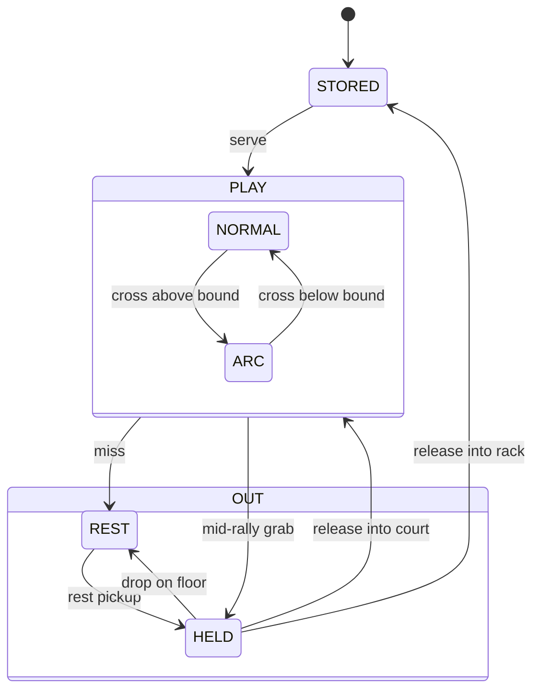

# Ball Lifecycle

Implementation spec for the single-entity ball model. Court-bound mechanics live in [`01-court-control.md`](01-court-control.md).

## One entity, many states

A ball is a single `Ball` node for its entire lifetime, across rack-stored, in-play, mid-arc, held, and resting phases. `Ball.play_state` drives physics and presentation. Transitions swap properties on the same body.

**STORED.** Body frozen, collision off, positioned at the rack slot.

**PLAY-NORMAL** (at or below the friendship-bound). `gravity_scale = 0`, speed locked, damping off.

**PLAY-ARC** (above the friendship-bound). `gravity_scale = 1`, speed-lock and damping off. Friendship pulls the ball back as engine gravity.

**OUT-REST.** Gravity engaged, damping engaged, REST physics-material. Rolls to rest on the venue floor.

**OUT-HELD.** Body frozen, collision and miss-detection suppressed. Drag controller drives position from the cursor.

## Ownership

`BallReconciler._balls_by_key` is the registry of balls. Membership means *the ball exists*. Removal means destruction. `BallTracker` re-emits `ball_added` / `ball_removed` to court-side consumers under the same invariant.

Court, Rack, and Venue query the registry by state:

- Court renders and runs physics on `PLAY_NORMAL` and `PLAY_ARC` balls.
- Rack renders `STORED` balls at slot positions.
- Venue floor renders `OUT_REST` balls in their current world position.

The reconciler is the scene-tree parent of every ball.

## Drag and drop

The drag controller drives `play_state` transitions. Release polls every drop target each physics frame; the first that accepts wins. Validation is a bounds check for containers and a body projection for the court. On acceptance the controller transitions the ball and sets its position and velocity from the gesture.
