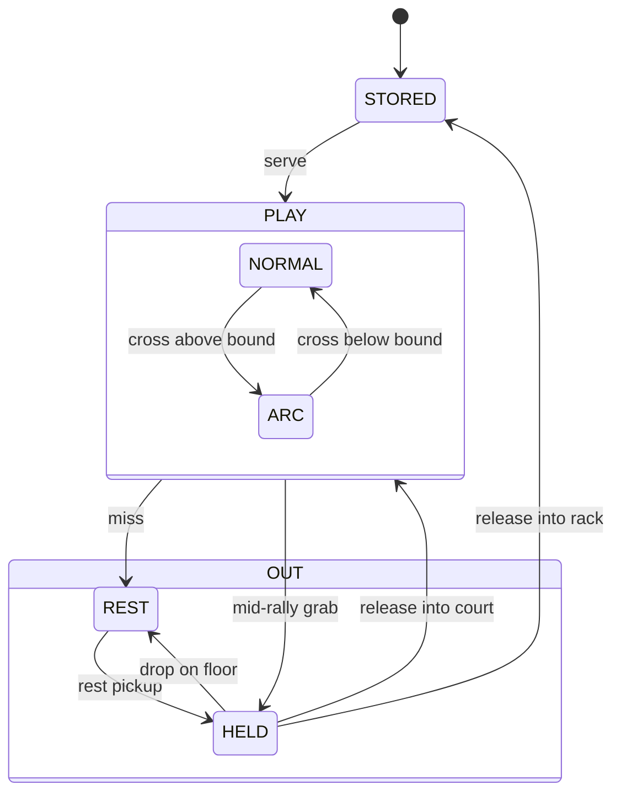

# Wall-less Court Control

Implementation spec for the wall-less court: friendship-bound replaces the top collider, lateral side bands replace the side wall colliders, the ground is unchanged. Drives SH-309. Player-facing design lives in [`../design/08-court-bounds.md`](../design/08-court-bounds.md).

## Ball states

Each ball runs an independent state machine. Multi-ball mixed-state is well-defined.

**STORED.** On the rack, no body.

**PLAY-NORMAL** (at or below the friendship-bound). `gravity_scale = 0`, speed locked, linear damping off.

**PLAY-ARC** (above the friendship-bound). `gravity_scale = 1`, speed-lock off, damping on. A centripetal force scaled by speed acts perpendicular to velocity, toward the play area; it rotates velocity without doing work. Friendship is still acting here; the centripetal force is its work above the bound.

While in PLAY, the ball tracks its pre-bound entry value: speed at the upward cross from NORMAL to ARC. Any speed change above the bound updates this value, so a paddle hit above the bound or a partner-active return captures the post-event speed. On the downward cross back to NORMAL, speed ramps to the tracked entry value; rally energy is preserved across the apex visit.

The apex mechanism is engaged-gravity-with-centripetal-bend, not a vertical-velocity flip. A flip reads as an invisible ceiling; the engaged form reads as a held curve. The ball stays in PLAY throughout; paddle hits register and the volley counter increments in ARC the same as in NORMAL.

**OUT-REST.** Out of play, on the venue floor. Includes the rolling-to-rest motion after a miss as well as the settled-and-still phase that follows. The ball waits to be grabbed.

**OUT-HELD.** Drag controller owns; the ball follows the cursor.

**Miss (PLAY → REST).** A ball whose centre crosses either lateral side band fires a miss: speed-lock releases, gravity engages, damping engages, the rally counter resets. The ball keeps its velocity at the moment of the crossing, falls under gravity, and rolls to rest on the venue floor. Past either side band there is no centripetal and no relock ramp. Player-side and partner-side are the same event.

**Mid-rally grab (PLAY → HELD).** The drag controller replaces the live ball with a held body before any side-band miss fires.

The friendship-bound height lives on `CourtConfig`; see Bound-height data shape below.

## Cross-bound collisions

Collisions between an above-bound ball and a below-bound ball resolve under each body's current physics state. The above-bound ball's velocity changes per real physics. The below-bound ball's velocity *direction* changes per the collision; its locked *speed* (magnitude) re-asserts immediately after, since the speed-lock only constrains magnitude. Velocity and speed are distinct: the lock is on speed; direction is free.

The bound is a state line, not a collision filter.

## Keeping the speed steady above the bound

The centripetal force above the friendship-bound bends velocity in theory without changing its magnitude. In practice, integrating it tick by tick drifts the magnitude up or down over time. Re-project velocity onto its tracked magnitude after each tick that applied the force to cancel the drift. Below the bound, the speed-lock already does this.

## Bound-height data shape

The friendship-bound height lives on a `CourtConfig` Resource from day one. Per-court tunables cluster on this Resource alongside the bound height; `Court` reads from it. Loose `@export` on `Court` is not the path. The bound may become upgradable later through items or progression.

## Drag-handoff frame window

Miss does not fire while a grab is in flight. The drag controller's deferred swap creates a window where the live ball can cross a side band before being replaced by the held body; during that window the side-miss check skips. The check resumes once the swap completes or the gesture cancels.

## Rest-roll energy loss

The rolled ball loses energy to venue-floor friction. Ball damping does not handle the rest-roll.
