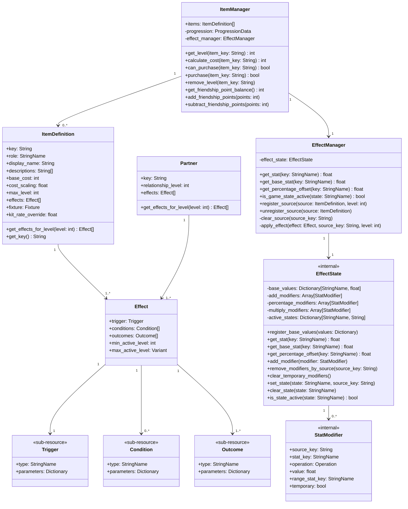

# Effect System: Prototype Implementation Record

As-built record for the prototype implementation (SH-41, SH-43). This document covers what was built and where it lives. The design authority is [`designs/effect-system/README.md`](../../effect-system/README.md).

---

## Class diagram

| Class | Role |
|---|---|
| `ItemDefinition` | Pure data template (Resource): display info, cost formula, effect definitions, authored `role`, optional `fixture` |
| `Partner` | NPC companion providing effects scaled by relationship level |
| `Effect` | One trigger + conditions + outcomes rule, gated by min/max active level |
| `Trigger` | When the effect fires. Type is a `StringName`, not an enum |
| `Condition` | Optional gate that must pass before outcomes execute |
| `Outcome` | What happens when the effect fires |
| `ItemManager` | Ownership and economy: tracks what the player owns, levels, and friendship balance. Delegates stat effects to `EffectManager` on level change |
| `EffectManager` | Evaluation engine and public stat API: registers/unregisters sources, dispatches outcomes by trigger type, delegates stat queries to `EffectState` |
| `EffectState` | Internal to `EffectManager`: holds base values from `GameRules.BASE_STATS`, modifier arrays (one per operation type), oscillations, and named game states. `get_stat` includes temporary modifiers; `get_base_stat` excludes them |
| `StatModifier` | One stat change: additive, percentage, or multiplicative. `temporary` flag marks modifiers cleared on miss. `range_stat_key` defers value resolution to query time |

`ItemDefinition` is a pure data template; level is stored per-player in `ProgressionData`, keyed by item key. `ItemManager` calls `EffectManager.unregister_source` then `register_source` on every level change.

---

## Godot integration

| Class | Godot type | Location |
|---|---|---|
| `ItemManager` | Autoload (Node) | `res://scripts/items/item_manager.gd` |
| `EffectManager` | Autoload (Node) | `res://scripts/items/effect/effect_manager.gd` |
| `EffectState` | RefCounted (internal to EffectManager) | `res://scripts/items/effect/effect_state.gd` |
| `ItemDefinition` | Resource | `res://resources/items/*.tres` |
| `Effect` | Resource | `res://scripts/items/effect/effect.gd` |
| `Trigger` | Resource (sub-resource) | Inline in Effect resource |
| `Condition` | Resource (sub-resource) | Inline in Effect resource |
| `Outcome` | Resource (sub-resource) | Inline in Effect resource |
| `StatModifier` | RefCounted | Created at runtime by `EffectManager` |
| `GameRules` | RefCounted (static constants) | `res://scripts/core/game_rules.gd` |
| `Partner` | Resource (planned) | `res://data/partners/` |

Effects, items, and partners are `.tres` resource files. Authored in data, loaded at runtime.

---

## Implementation status

### Implemented (SH-41, SH-43)

- All stat keys exposed via `GameRules.BASE_STATS` and queried through `ItemManager.get_stat()`.
- Event dispatch: `ItemManager.process_event()` fires registered effects with matching triggers. `Game.gd` wires ball signals (`at_max_speed_changed`, `missed`) to dispatch `on_max_speed_reached` and `on_miss`.
- Named game states tracked in `EffectState` via `set_state()`/`clear_state()`/`is_state_active()`.
- Ball reads speed limits every physics frame via `BallEffectProcessor._sync_speed_limits()`, enabling dynamic stat changes to take effect immediately.
- `GameRules.BALL_SPEED_MIN` and `BALL_SPEED_MAX` constants removed; replaced by stat-driven values.
- Percentage modifier operation: values summed into a single offset, then applied as `result *= (1.0 + total_offset)`. Evaluation order: add, then percentage, then multiply.
- `paddle_size_min` base stat (50.0) clamps the paddle so percentage reductions cannot shrink it below a playable size.

### Remaining

- Causality items need temporary outcome expiry (timer or per-frame tick) for `multiply_stat_temporary`.
- Multi-ball requires a ball spawner and a reference list of active balls in the scene. `clear_extra_balls` removes all but the original.
