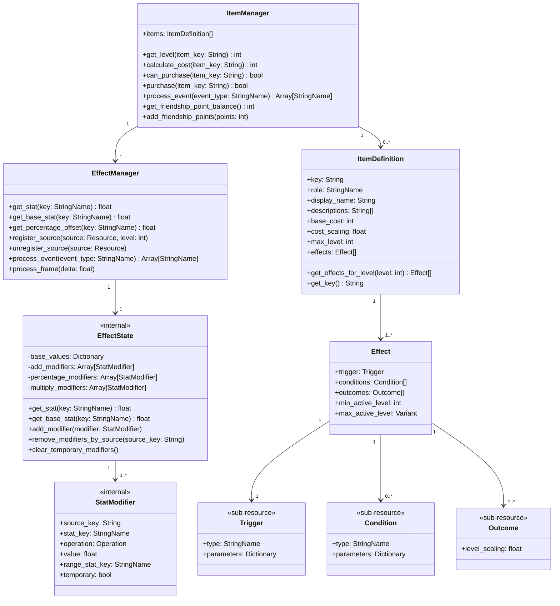
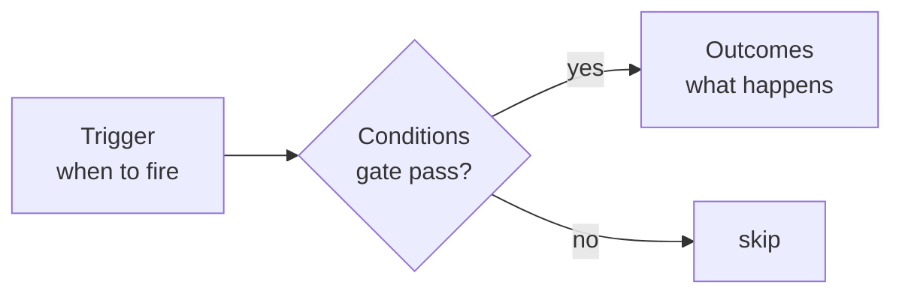
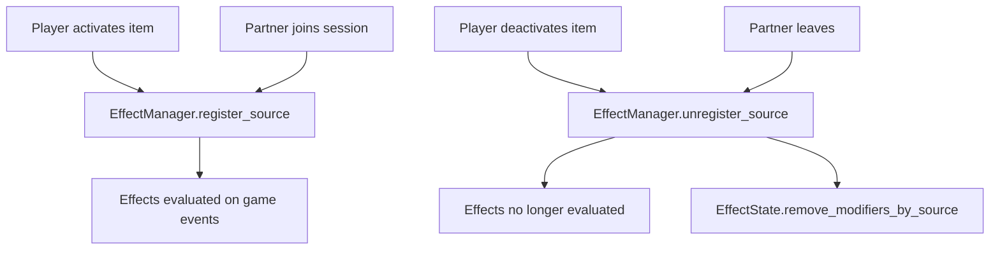

# Effect System

All gameplay modifiers in Volley flow through one system. Items, partners, and any future sources share the same data shape: a trigger, optional conditions, and one or more outcomes. Adding a new item means adding data; the evaluation loop is in one place.

## Architecture



## Effect anatomy

Every effect is a `trigger + conditions + outcomes` rule authored as a Godot Resource. No per-item scripts.



The trigger names when evaluation runs. Conditions filter whether the outcomes execute. Outcomes apply the change: a stat modifier, a game action, or an oscillation.

## Source registration



Every source follows the same path: register on activate, unregister on deactivate. No type-specific branching.

## Level scaling

Each outcome has a `level_scaling` property (default 1.0) that controls value growth across item levels.

```
effective_value = base_value * (1.0 + level_scaling * (level - 1))
```

Level 1 always applies the base value. Examples: `1.0` gives linear growth (×1, ×2, ×3); `0.5` gives half growth (×1, ×1.5, ×2); `0.0` gives the same value at every level.

## Godot integration

| Class | Godot type | Path |
|---|---|---|
| `ItemManager` | Autoload (Node) | `res://scripts/items/item_manager.gd` |
| `EffectManager` | Node (owned by ItemManager) | `res://scripts/items/effect/effect_manager.gd` |
| `EffectState` | RefCounted (internal) | `res://scripts/items/effect/effect_state.gd` |
| `Effect` | Resource | `res://scripts/items/effect/effect.gd` |
| `Trigger` | Resource (sub-resource) | `res://scripts/items/effect/trigger.gd` |
| `Condition` | Resource (sub-resource) | `res://scripts/items/effect/condition.gd` |
| `Outcome` | Resource (sub-resource, base class) | `res://scripts/items/effect/outcome.gd` |
| `StatModifier` | RefCounted (runtime) | `res://scripts/items/effect/stat_modifier.gd` |

Items and their effects are `.tres` resource files. Authored in data, loaded at runtime.

## Further reading

- [reference.md](reference.md): trigger, outcome, and condition types; stat key register; which are live and which are prototype ideas
- [runtime.md](runtime.md): event-to-outcome flow, stat resolution order, oscillation model, delayed effects
