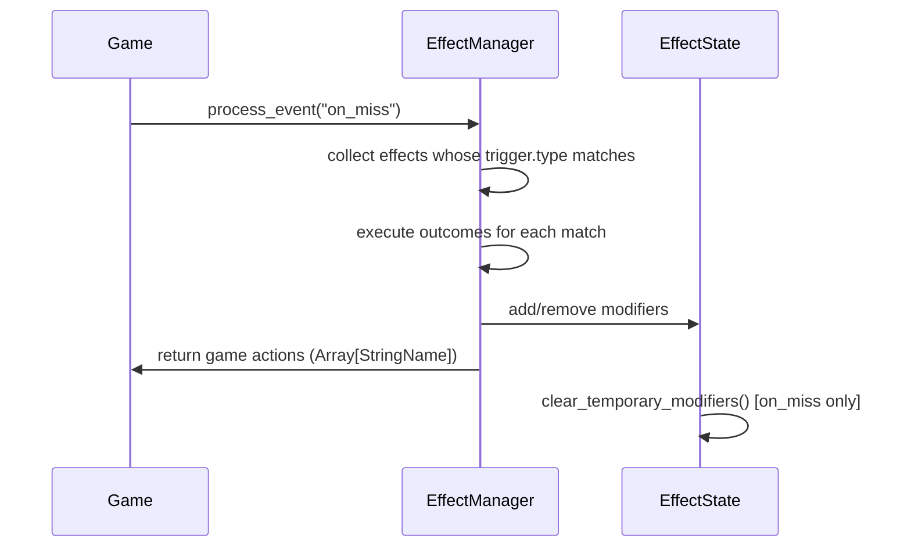
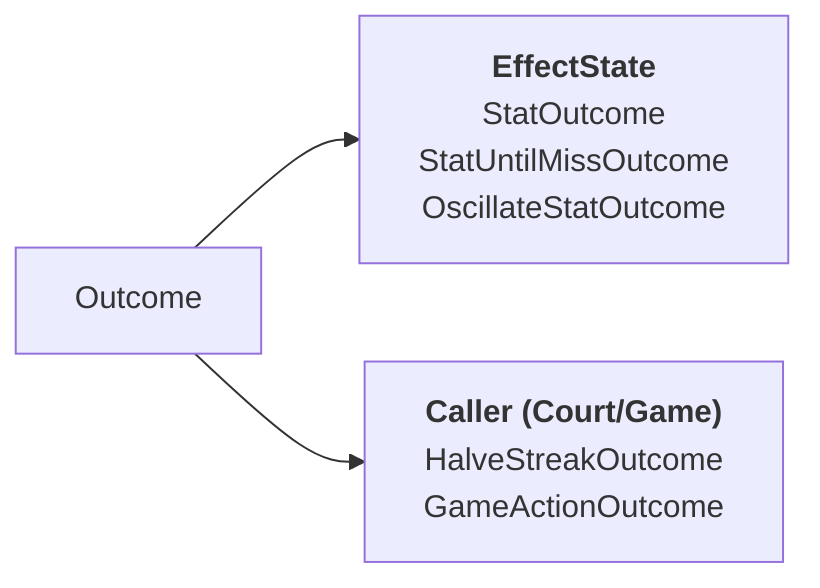
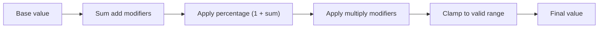
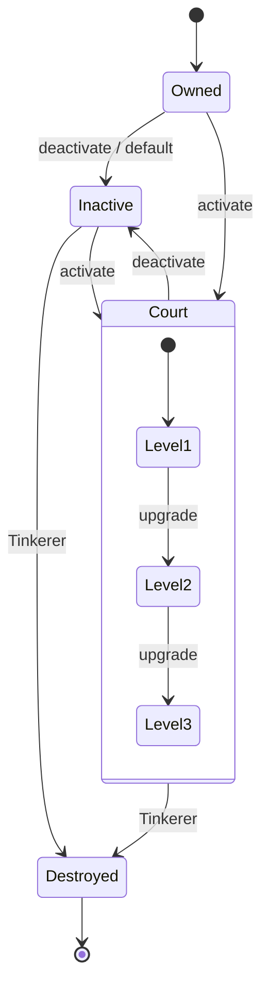

# Effect System: Runtime Behaviour

How the effect system moves from a game event to an outcome. Stat resolution, oscillation, and the item lifecycle diagrams.

---

## Event to outcome



`process_event` returns an `Array[StringName]` of game actions to the caller. The caller (usually `Court`) acts on them; the effect system does not reach into the scene graph.

---

## Outcome routing



Stat outcomes write to `EffectState` directly. Game actions return a key string; the caller decides what to do with it.

---

## Stat resolution



`EffectManager.get_stat(key)` is the single query point. All gameplay code calls it; nothing reads raw base values.

`get_base_stat(key)` excludes temporary modifiers (those with `temporary = true`). Use it when a proportional modifier should scale against a stable baseline rather than the live modified value.

Example: base 50, +10 add, +140% percentage, ×2 multiply gives `(50 + 10) * (1 + 1.4) * 2 = 288`.

---

## Oscillation

`OscillateStatOutcome` runs continuously, not on events. `EffectManager.process_frame(delta)` ticks it every physics frame.

```
value = base + amplitude * sin(time * frequency + phase_offset)
```

Frequency and phase offset are randomised per effect instance. Amplitude scales with item level. The modifier updates through `EffectState` like any other, but its value changes every frame.

---

## Item lifecycle

Standard items follow a simple path.



Every level change calls `unregister_source` then `register_source` with the new level, passing it to `get_effects_for_level()`. The effect set for the new level replaces the old one atomically.

---

## `always` trigger

`always` effects apply on registration and re-apply on every level change. They are permanent stat modifiers for the life of the source's registration; no game event is needed to trigger them.

Passive items (Ankle Weights, Grip Tape, Court Lines, Training Ball, Wrist Brace) use `always` exclusively.

---

## Temporary modifiers

Modifiers with `temporary = true` are excluded from `get_base_stat` and cleared by `clear_temporary_modifiers()`, which fires at the end of every `on_miss` dispatch. The outcome sets the flag; `EffectState` does not know the reason.

`StatUntilMissOutcome` is the current user. Cadence uses it to hold a ceiling raise until the next miss.

---

## `ItemDefinition` is pure data

`ItemDefinition` is a Resource with no level or runtime state on the instance. Level lives in `ProgressionData`, keyed by item key. `ItemManager` owns the economy; `EffectManager` owns the evaluation.
