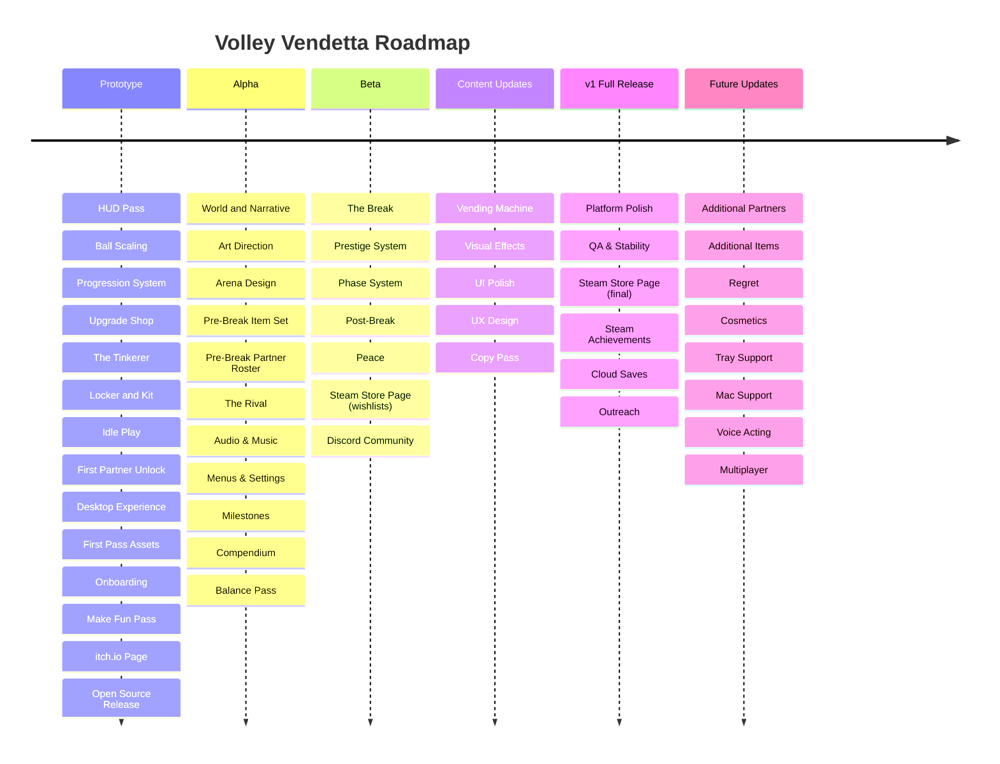

# Volley Vendetta - Roadmap

## Game phases

The player experiences the game in six phases. Each phase transition triggers a prestige (mechanical reset with narrative shift). Post-game prestige is continuous.

| Phase | What the player experiences |
|---|---|
| Pre-break | The cozy idle game. Volley, earn FP, recruit partners, buy items. The surface is warm and earnest. Clues are present but read as flavour. |
| Break | The snap. The record cannot be beaten. The ball slows against something external. Cut to black, the reveal. One specific truth, clearly committed to. |
| Credits 1 | A brief credits scene. The game acknowledges what just happened before continuing. |
| Post-break | The game continues with the player knowing the truth. The surface is the same but the weight is different. Partners speak differently. The world is still cozy but it no longer pretends. |
| Full credits | The complete credits. The game is finished. |
| Post-game | Free play. No narrative weight, no tension. The player can prestige freely. Everything is earned. |

Prestige resets the mechanical loop (streak, ball speed, items) but preserves progression state (unlocked partners, compendium). Each phase transition prestige changes what the game shows the player. Post-game prestige is the same loop without narrative gates.

---

## Prototype

The public demo on itch.io. The core loop working, looking, and sounding good enough to share with strangers. First-pass art and sound throughout. Everything a player needs to understand what the game is and want more.

Contains: the volley, the FP economy, the shop, the tinkerer, locker and kit, idle play, Martha, desktop experience, first-pass assets, onboarding, and a make fun pass to tune it all. Ends with the open source release: repo and itch.io transferred to the Shuck Games org, history scrubbed, preview builds working.

Done when you'd give it to someone who's never heard of the game and they'd play it for an afternoon.

## Alpha

Pre-break up and running. Writing locks the narrative and characters. Art direction sets the visual rules, then real art replaces first-pass assets as each piece of content ships. Arena design works out all arenas. The pre-break item set and partner roster ship here, each partner bringing their own art, animation, and barks. The rival appears mid pre-break as a milestone gate, introducing battle mode. Audio and music fill out the world. Milestones land. World and Narrative includes the high-level break design so Beta can implement without waiting. Balance pass tunes it all. Writing lands alongside the content it supports rather than as separate deliverables.

Done when the pre-break game is finished: real art, real sound, pre-break roster, pre-break item set, milestones, the clue ladder in place, and the break designed.

## Beta

The overall game structure, all phases working. The break design from Alpha is implemented. The prestige system and phase system are built. Post-break and post-game exist as playable states. The full arc from pre-break through to post-game is playable.

Done when a player can experience every phase of the game from start to post-game.

## Content Updates

Supplementary content that enriches the main game. Visual effects, UI polish, UX refinement, vending machine, and a copy pass. These add depth and breadth but the game is structurally complete without them.

Done when the game feels full, polished, and ready for a wider audience.

## v1 Full Release

Lock everything. Platform polish, QA, Steam store page, and outreach. No new features, no new content. The game is complete; this phase ships it.

Done when you'd be happy putting it on Steam and telling people to play it.

## Future Updates

Post-launch content: additional partners and items for the main game, Regret (an alternate post-game with its own partners, items, effects, and tone; the player chooses to enter the game from the perspective of someone who didn't move on), achievements, cosmetics, tray support, Mac support, voice acting, multiplayer.
