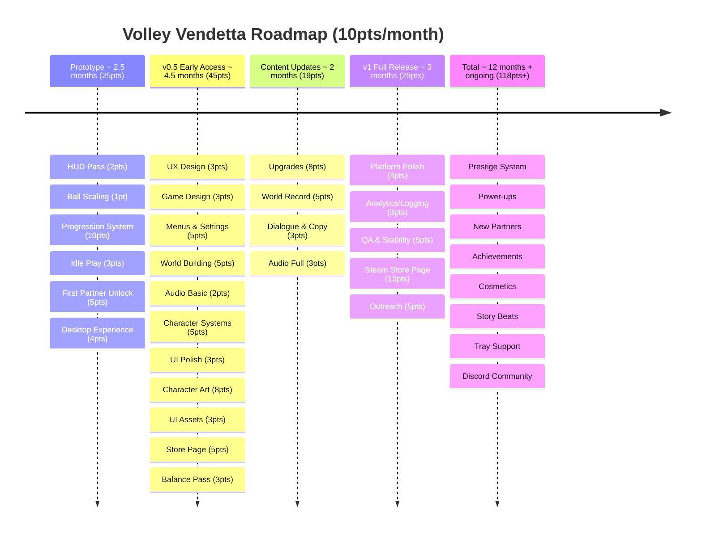

# Volley Vendetta - Roadmap

## Prototype (minimum fun gameplay) - 25pts
The core loop works and it feels good to play for 10 minutes. Placeholder art is fine.

1. **HUD Pass** (2pts, Feature) - volley counter with reset on miss, high score display, VolleyTracker refactor
2. **Ball Scaling** (1pt, Feature) - ball speeds up during a streak, creating natural difficulty curve
3. **Progression System** (10pts, Spike) - earn FP from volleys, 3 upgrades (paddle speed, size, ball start speed), save/load persistence
4. **Idle Play** (3pts, Spike) - paddles play on their own when player isn't touching controls
5. **First Partner Unlock** (5pts, Spike) - spend FP to recruit your first partner, replaces the wall as an upgrade milestone
6. **Desktop Experience** (4pts, Spike) - borderless small window, always on top, minimal UI, Windows build

Prototype done = you can leave it running on your desktop, come back, upgrade, and your streak gets further than last time.

## v0.5 Early Access (fun is proven) - 45pts
Design locked, full art pass, basic sound. The game is fun and polished enough to share.

**Urgent (16pts)**
1. Design: UX Design (3pts) - flows, navigation, idle transitions, upgrade shop UX
2. Design: Game Design (3pts) - partner abilities, upgrade effects, world record milestones, progression pacing
3. Tech: Menus & Settings (5pts) - pause menu, settings, volume, controls rebind
4. Writing: World Building (5pts) - lore, characters, setting, tone

**High (7pts)**

5. Sound: Audio - Basic (2pts) - essential hit sounds, miss sounds, streak milestone
6. Tech: Character Systems (5pts) - paddle reactions, expressions, state machine for personality

**Medium (19pts)**

7. Tech: UI Polish (3pts) - HUD animations, streak indicators, score transitions
8. Art: Character Art (8pts) - paddle sprites, expressions, animations, partner visuals
9. Art: UI Assets (3pts) - HUD icons, upgrade artwork, visual elements
10. Art: Store Page (5pts) - cover art, banner, screenshots, GIF/trailer, itch page formatting

**Low (3pts)**

11. Design: Balance Pass (3pts) - upgrade costs, ball scaling curve, time to world record

## v0.6 - v0.9 Content Updates - 19pts
Progressive content drops building toward v1.

- Tech: Game Content - Upgrades (8pts) - full upgrade tree implementation
- Tech: Game Content - World Record (5pts) - world record goal, milestones, 3-5 partners
- Writing: Dialogue & Copy (3pts) - in-game text, reactions, descriptions
- Sound: Audio - Full (3pts) - ambient music, fanfares, audio polish

## v1 Full Release - 29pts
Platform polish, stability, analytics, and Steam launch. The complete package.

- Tech: Platform Polish (3pts) - Linux export, window management
- Tech: Analytics/Logging (3pts) - basic telemetry, display stats on itch page
- Tech: QA & Stability (5pts) - bug fixes, optimisation, error handling
- Art: Steam Store Page (13pts) - capsule images, screenshots, trailer, Steamworks setup, store page copy, review process
- Outreach (5pts) - social media, press outreach, review keys, devlog posts, streamer/YouTuber outreach

v1 done = you'd be happy putting it on itch.io and telling people to play it.

## Future updates
Post-launch features for an update stream. Each one could be its own release.

- **Prestige system** - reset progress for a permanent multiplier, extends the endgame
- **Power-ups** - temporary modifiers that drop during play (multi-ball, slow-mo, magnet paddle)
- **New partners** - more characters with new abilities, keeps the roster fresh
- **Achievements** - milestones that reward FP or cosmetics
- **Cosmetics** - paddle skins, ball trails, arena themes
- **Story beats** - more narrative moments as you progress past the world record
- **Tray support** - minimise to system tray (Windows and Linux where supported)
- **Discord community** - set up and manage a community server
