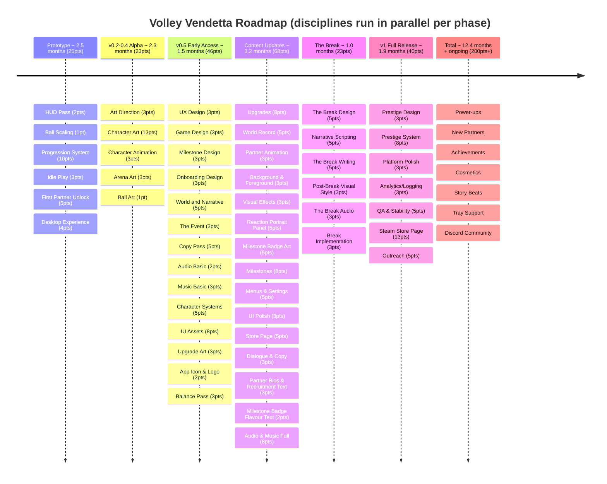

# Volley Vendetta - Roadmap

## Prototype (minimum fun gameplay) - 25pts
The core loop works and it feels good to play for 10 minutes. Placeholder art is fine.

1. **HUD Pass** (2pts, Feature) - volley counter with reset on miss, high score display, VolleyTracker refactor
2. **Ball Scaling** (1pt, Feature) - ball speeds up during a streak, creating natural difficulty curve, paddle hit sound
3. **Progression System** (10pts, Spike) - earn FP from volleys, 3 upgrades (paddle speed, size, ball start speed), save/load persistence
4. **Idle Play** (3pts, Spike) - paddles play on their own when player isn't touching controls
5. **First Partner Unlock** (5pts, Spike) - spend FP to recruit your first partner, replaces the wall as an upgrade milestone
6. **Desktop Experience** (4pts, Spike) - borderless small window, always on top, minimal UI, Windows build

Prototype done = you can leave it running on your desktop, come back, upgrade, and your streak gets further than last time.

## v0.2-0.4 Alpha (visual foundations) - 23pts
Full visual language established before the game is shared. Placeholder art replaced.

1. **Art: Art Direction** (3pts) - visual style guide, colour palette, typography, overall aesthetic — sets the rules everything else follows
2. **Art: Character Art** (13pts) - player paddle, 3-5 partner sprites, expressions per character
3. **Art: Character Animation** (3pts) - player paddle and first partner only; idle, hit, miss states. Further partners deferred to Content Updates.
4. **Art: Arena Art** (3pts) - court, walls, floor, the visual space the game lives in
5. **Art: Ball Art** (1pt) - ball design consistent with visual language

Alpha done = the game has a coherent visual identity. No more placeholders.

## v0.5 Early Access (fun is proven) - 49pts
Design locked, basic sound, polished enough to share.

**Urgent (19pts)**
1. Design: UX Design (3pts) - flows, navigation, idle transitions, upgrade shop UX
2. Design: Game Design (3pts) - partner abilities, upgrade effects, progression pacing
3. Design: Milestone Design (3pts) - define the full badge set, triggers, rewards, and collection UX; feeds Art and Tech
4. Design: Onboarding Design (3pts) - first-run experience; how the game introduces itself, the paddle, and the dream without a tutorial
5. Writing: World and Narrative (5pts) - lore, characters, setting, tone
6. Writing: The Event (3pts) - decide what actually happened; the real thing the game-world is a fiction for. Must be resolved before The Break can be built.

**High (12pts)**

7. Writing: Copy Pass (5pts) - onboarding text, upgrade descriptions, and welcome back messages; all short-form copy that sets tone across the early game
8. Sound: Audio Basic (2pts) - essential hit sounds, miss sounds, streak milestone
9. Sound: Music Basic (3pts) - main menu theme and one gameplay loop
10. Tech: Character Systems (5pts) - paddle reactions, expressions, state machine for personality

**Medium (13pts)**

10. Art: UI Assets (8pts) - HUD icons, partner unlock screens, visual elements, UI animation
11. Art: Upgrade Art (3pts) - visual representations of each upgrade in the shop
12. Art: App Icon & Logo (2pts) - game logo and icon variants for desktop and store

**Low (3pts)**

13. Design: Balance Pass (3pts) - upgrade costs, ball scaling curve, time to world record

## v0.6 - v0.9 Content Updates - 68pts
Progressive content drops building toward v1. Partners, milestones, polish. Everything except the break.

- Tech: Upgrades (8pts) - full upgrade tree implementation
- Writing/Tech: World Record (5pts) - name, personality, backstory and abilities for 3-5 partners; establish the world record number
- Art: Partner Animation (3pts) - animation states for remaining partners, ball and arena animation
- Art: Background & Foreground (3pts) - atmospheric layers, depth, parallax elements
- Tech: Visual Effects (3pts) - hit sparks, streak glow, miss reaction
- Art: Reaction Portrait Panel (5pts) - portrait crops per partner, panel design, slides in on quips/reactions/milestones
- Art: Milestone Badge Art (5pts) - individual badge designs for the milestone collection
- Tech: Milestones (8pts) - streak milestones, record milestones, collection UI, FP or narrative rewards on trigger
- Tech: Menus & Settings (5pts) - pause menu, settings, volume, controls rebind
- Tech: UI Polish (3pts) - HUD animations, streak indicators, score transitions
- Art: Store Page (5pts) - cover art, banner, screenshots, GIF/trailer, itch page formatting
- Writing: Dialogue & Copy (3pts) - general in-game text, UI copy, partner idle reactions
- Writing: Partner Bios & Recruitment Text (3pts) - name, bio, recruitment line per partner
- Writing: Milestone Badge Flavour Text (2pts) - badge names and a line each
- Sound: Audio & Music Full (8pts) - fanfares, audio polish, character motifs per partner, remaining tracks

## The Break - 26pts
The moment the game changes. All disciplines converge here. Nothing ships until it's all ready.

- Design: The Break Design (5pts) - define the moment, the one specific thing revealed, the art direction brief; and design the post-Break state for a player who now knows the truth
- Writing: Narrative Scripting (5pts) - signal-layer dialogue per partner, the full clue ladder executed in actual lines
- Writing: The Break Writing (5pts) - the reveal moment copy and post-Break framing; what the player reads when the world changes and what they carry forward
- Art: Post-Break Visual Style (3pts) - the different art language for the reveal, designed and integrated
- Sound: The Break Audio (3pts) - the audio treatment of the snap moment; silence, shift, or something that makes the player feel the world change
- Tech: Break Implementation (3pts) - trigger, transitions, wiring it all together

The Break done = the twist lands. The player feels it without being told it.

## v1 Full Release - 40pts
Platform polish, stability, analytics, prestige, and Steam launch. The complete package.

- Design: Prestige Design (3pts) - full design of the prestige system; reset loop, multipliers, what changes and what doesn't
- Tech: Prestige System (8pts) - reset loop implementation, multipliers, post-prestige state
- Tech: Platform Polish (3pts) - Linux export, window management
- Tech: Analytics/Logging (3pts) - basic telemetry, display stats on itch page
- Tech: QA & Stability (5pts) - bug fixes, optimisation, error handling
- Art: Steam Store Page (13pts) - capsule images, screenshots, trailer, Steamworks setup, store page copy, review process
- Outreach (5pts) - social media, press outreach, review keys, devlog posts, streamer/YouTuber outreach

v1 done = you'd be happy putting it on itch.io and telling people to play it.

## Future updates
Post-launch features for an update stream. Each one could be its own release.

- **Power-ups** - temporary modifiers that drop during play (multi-ball, slow-mo, magnet paddle)
- **New partners** - more characters with new abilities, keeps the roster fresh
- **Achievements** - milestones that reward FP or cosmetics
- **Cosmetics** - paddle skins, ball trails, arena themes
- **Story beats** - more narrative moments as you progress past the world record
- **Tray support** - minimise to system tray (Windows and Linux where supported)
- **Discord community** - set up and manage a community server
