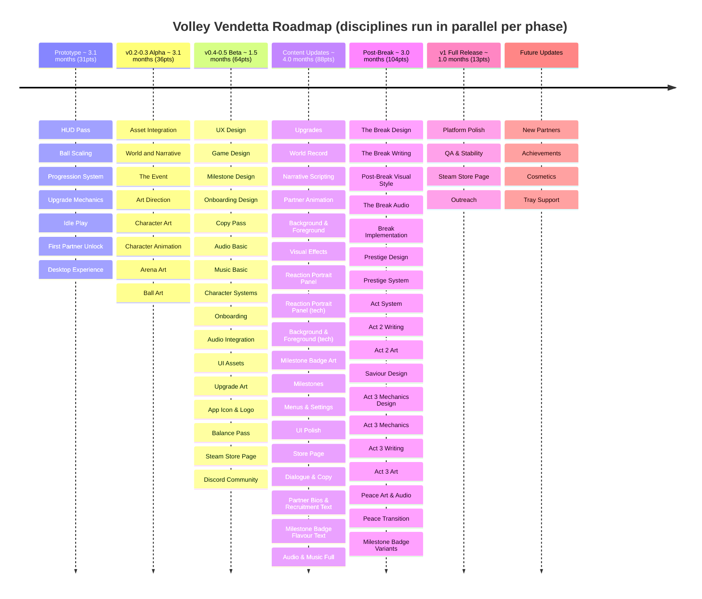

# Volley Vendetta - Roadmap

**Total: ~15.7 months** (art, sound, writing, tech+design running in parallel per phase) (art, sound, writing, tech+design running in parallel per phase)

## Prototype

All tech. The core loop working and feeling good: the volley, the FP economy, upgrades that feel satisfying, idle play, and a first partner to recruit. Shipped as a borderless desktop window on Windows. Placeholder art throughout.

Done when you can leave it running, come back, upgrade, and get further than last time.

## v0.2-0.3 Alpha

Writing first, then art. World and Narrative and The Event must be settled before Art Direction begins so the artist knows who these characters are, what world they inhabit, and what the tone needs to carry. Once writing is locked, art follows: Art Direction sets the rules, then characters, animation, arena, and ball. No placeholders remain by the end.

Done when the game has a coherent visual identity grounded in the narrative.

## v0.4-0.5 Beta

All disciplines. Design locked, sound in, polished enough to share. The goal is Steam wishlists: a build people can see, play, and want.

Done when you'd send it to strangers and tell them to wishlist it.

## v0.6-0.9 Content Updates

All disciplines. Full partner roster, complete upgrade tree, milestone system, audio finished, and the signal-layer narrative woven into partner dialogue as it's written. Everything except The Break moment itself.

Done when the game is content-complete and the clue ladder is in place.

## Post-Break

All disciplines converge on the Break, then continue through the full three-act narrative loop. The Break Design gates everything: art, audio, writing, and implementation all follow from it. Once the twist lands, Post-Break carries through Acts 2 and 3, the prestige system, and the Peace state.

Done when the full act structure is playable and the player can reach Peace.

## v1 Full Release

Platform polish, QA, Steam launch. No new features, no act content. The game is complete; this phase ships it.

Done when you'd be happy putting it on Steam and telling people to play it.

## Future Updates

New partners, achievements, cosmetics, tray support.
