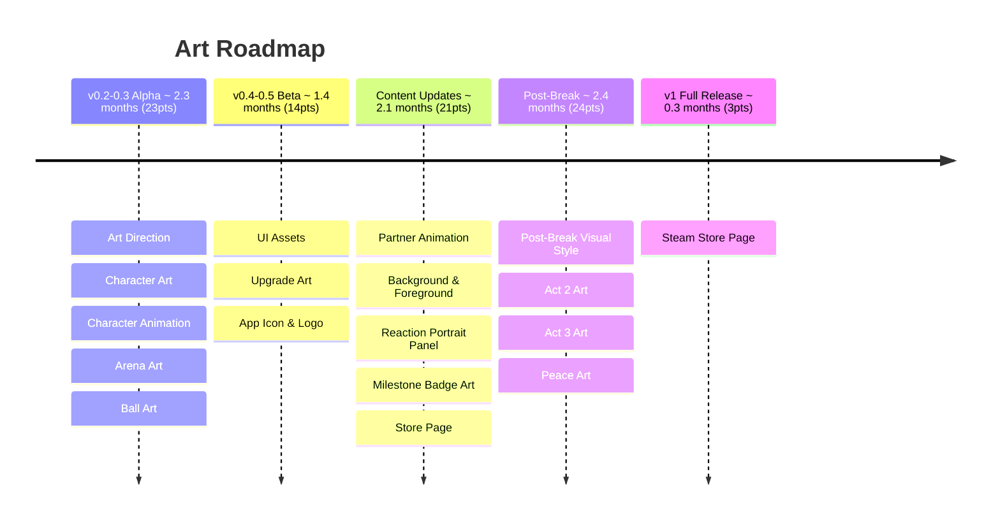

# Volley Vendetta - Art Roadmap

**Total: ~8.5 months (85pts)**

## v0.2-0.3 Alpha

**Art Direction** establishes the visual rules everything else follows: style guide, colour palette, typography, and overall aesthetic. Nothing else in art gets started until this is locked.

**Character Art** covers the player paddle, three to five partner sprites, and expressions per character. The partners need enough visual personality to carry the signal-layer narrative, so expression range matters as much as base design.

**Character Animation** is scoped to the player paddle and first partner only at this stage: idle, hit, and miss states. Further partner animation is deferred to Content Updates once the full roster is designed.

**Arena Art** defines the court, walls, and floor, the visual space the game lives in. Should feel like a real place without demanding attention.

**Ball Art** brings the ball in line with the visual language established by Art Direction.

## v0.4-0.5 Beta

**UI Assets** covers everything the HUD and menus need to feel finished: icons, partner unlock screens, visual elements, and UI animation. This is the bulk of the Beta art work and feeds directly into the tech UI pass.

**Upgrade Art** gives each upgrade a visual representation in the shop. Players should be able to understand what they're buying at a glance.

**App Icon & Logo** produces the game logo and icon variants for desktop and store use. Needed before the Steam Store Page work begins.

## Content Updates

**Partner Animation** extends animation states to all remaining partners, and adds movement to the ball and arena. The game should feel alive even when the player isn't actively watching.

**Background & Foreground** adds atmospheric layers, depth, and parallax elements to the arena. Adds visual richness without distracting from the volley.

**Reaction Portrait Panel** produces portrait crops per partner and designs the panel that slides in when a partner reacts to quips, milestones, or key moments. This is the primary surface for character personality.

**Milestone Badge Art** designs individual badges for the milestone collection. Each badge has meaning tied to The Event; the art should feel like an achievement, not just an icon.

**Store Page** (itch.io) covers cover art, banner, screenshots, a GIF or short trailer, and itch page formatting. This is the game's public face before Steam launch.

## Post-Break

**Post-Break Visual Style** designs and integrates the different art language used during the reveal sequence. The reveal image is in a different style to everything else in the game: rawer, less constructed. This is the only moment the game drops its aesthetic.

**Act 2 Art** covers any visual work needed for the rival's softening arc and the saviour's introduction. Expression variants, portrait panel additions, or visual state changes depending on what Saviour Design and Act 2 Writing establish.

**Act 3 Art** covers milestone badge art variants for Act 3: the same badges, but the art shifts to reflect what the numbers actually mean. Scope depends on Act 3 Mechanics Design.

**Peace Art** produces the visual shift for the post-game state: a change in palette, lighting, or overall register that makes Peace feel like a version of the game that could only exist after what came before.

## v1 Full Release

**Steam Store Page** is the full Steamworks treatment: capsule images, screenshots, trailer, store page copy, and submission for review. This is the last art deliverable and gates the Steam launch.
