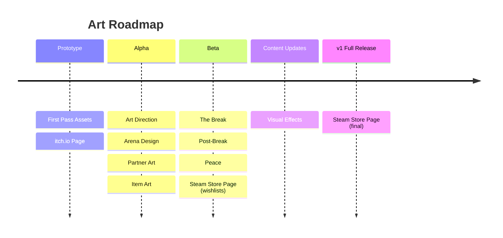

# Volley Vendetta - Art Roadmap

## Prototype

**First Pass Assets** produces placeholder-quality-but-complete visuals for the demo: paddle sprites, ball, arena, shop UI, Martha's paddle, and basic item icons. Not final art; enough that the game looks intentional. Replaced in Alpha.

**itch.io Page** covers cover art, banner, screenshots, and page formatting for the prototype demo.

## Alpha

**Art Direction** establishes the visual rules everything else follows: style guide, colour palette, typography, and overall aesthetic.

**Arena Design** works out all arenas including background and foreground layers. The visual space the game lives in.

**Partner Art** ships with each pre-break partner: sprite, expressions, animation states (idle, hit, miss). Each partner is a complete art package. Post-break partners ship in Beta.

**Item Art** ships with each pre-break item: visual representation in the shop and kit. Ball art is part of item art where relevant. Post-break items ship in Beta.

## Beta

**The Break** designs and produces the reveal image in a different art style. Rawer, less constructed. The only moment the game drops its aesthetic.

**Post-Break** covers visual changes for the post-break state: expression variants, shifted palettes, post-break partner and item art.

**Peace** produces the visual shift for post-game: palette, lighting, or register change.

**Steam Store Page (wishlists)** produces the initial capsule images, screenshots, and trailer for the Steam page.

## Content Updates

**Visual Effects** adds hit sparks, streak glow, and miss reactions.

## v1 Full Release

**Steam Store Page (final)** updates the Steamworks page with final art: capsule images, screenshots, trailer, and submission for review.
