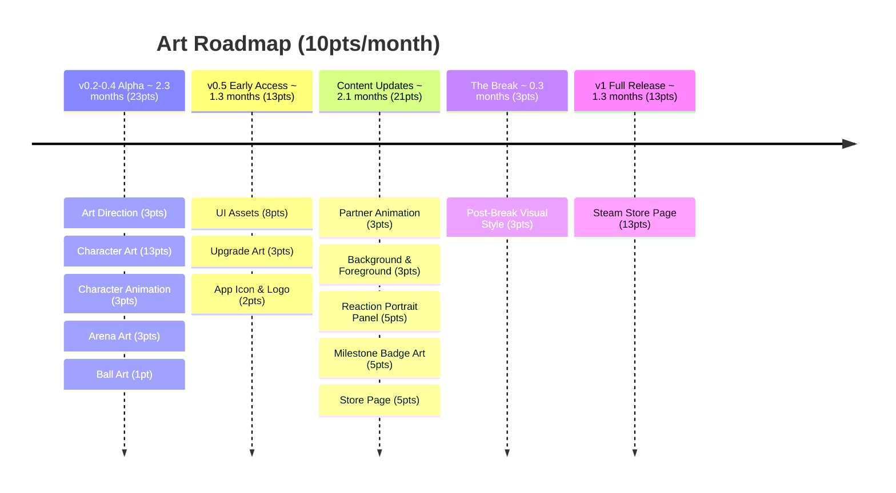

# Volley Vendetta - Art Roadmap

## v0.2-0.4 Alpha - 23pts

1. **Art Direction** (3pts) - visual style guide, colour palette, typography, overall aesthetic — sets the rules everything else follows
2. **Character Art** (13pts) - player paddle, 3-5 partner sprites, expressions per character
3. **Character Animation** (3pts) - player paddle and first partner only; idle, hit, miss states
4. **Arena Art** (3pts) - court, walls, floor, the visual space the game lives in
5. **Ball Art** (1pt) - ball design consistent with visual language

## v0.5 Early Access - 13pts

6. **UI Assets** (8pts) - HUD icons, partner unlock screens, visual elements, UI animation
7. **Upgrade Art** (3pts) - visual representations of each upgrade in the shop
8. **App Icon & Logo** (2pts) - game logo and icon variants for desktop and store

## Content Updates - 21pts

9. **Partner Animation** (3pts) - animation states for remaining partners, ball and arena animation
10. **Background & Foreground** (3pts) - atmospheric layers, depth, parallax elements
11. **Reaction Portrait Panel** (5pts) - portrait crops per partner, panel design, slides in on quips/reactions/milestones
12. **Milestone Badge Art** (5pts) - individual badge designs for the milestone collection
13. **Store Page** (5pts) - cover art, banner, screenshots, GIF/trailer, itch page formatting

## The Break - 3pts

14. **Post-Break Visual Style** (3pts) - the different art language for the reveal, designed and integrated

## v1 Full Release - 13pts

15. **Steam Store Page** (13pts) - capsule images, screenshots, trailer, Steamworks setup, store page copy

---
**Total: 73pts**
