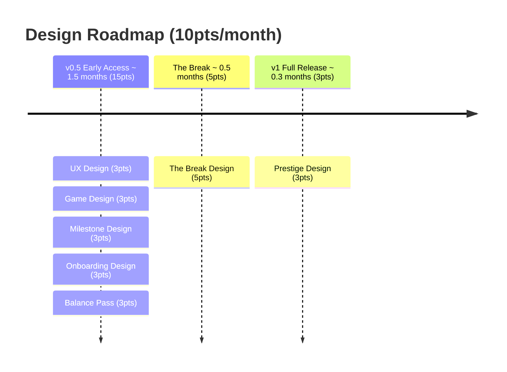

# Volley Vendetta - Design Roadmap

## v0.5 Early Access - 15pts

1. **UX Design** (3pts) - flows, navigation, idle transitions, upgrade shop UX
2. **Game Design** (3pts) - partner abilities, upgrade effects, progression pacing
3. **Milestone Design** (3pts) - define the full badge set, triggers, rewards, and collection UX; feeds Art and Tech
4. **Onboarding Design** (3pts) - first-run experience; how the game introduces itself, the paddle, and the dream without a tutorial
5. **Balance Pass** (3pts) - upgrade costs, ball scaling curve, time to world record

## The Break - 5pts

6. **The Break Design** (5pts) - define the moment, the one specific thing revealed, the art direction brief; and design the post-Break state for a player who now knows the truth

## v1 Full Release - 3pts

7. **Prestige Design** (3pts) - full design of the prestige system; reset loop, multipliers, what changes and what doesn't

---
**Total: 23pts**
