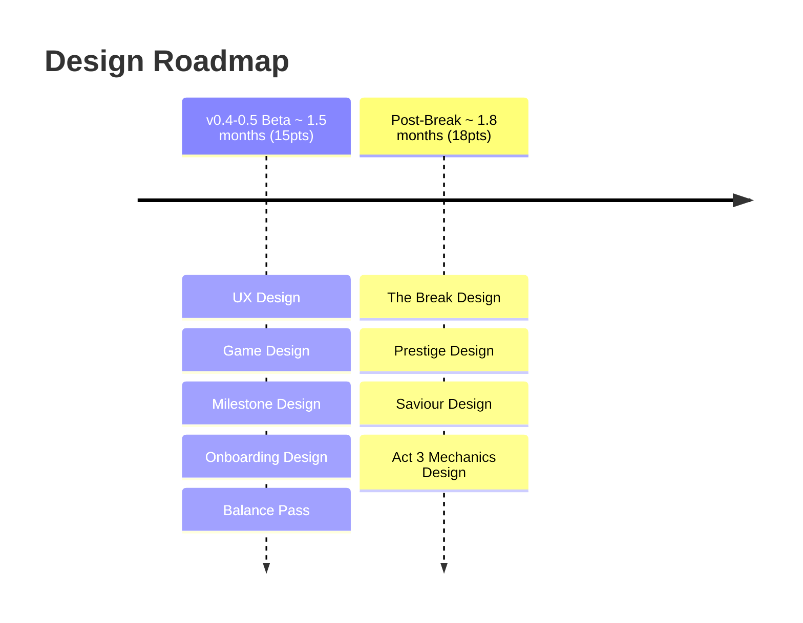

# Volley Vendetta - Design Roadmap

**Total: ~3.3 months (33pts)**

## v0.4-0.5 Beta

**UX Design** defines how the player moves through the game: flows, navigation, idle transitions, and the upgrade shop UX. The game lives in a small window and runs in the background; the UX needs to respect that contract at every touchpoint.

**Game Design** specifies partner abilities, upgrade effects, and progression pacing. This feeds directly into tech implementation, so it needs to be concrete enough to build from, not a mood board.

**Milestone Design** defines the full badge set: what triggers each one, what it rewards, and how the collection UI works. The milestone numbers are not arbitrary; they must encode something meaningful to The Event, so this work depends on The Event being decided first.

**Onboarding Design** designs the first-run experience: how the game introduces itself, the paddle, and the dream without a tutorial. The player should understand what to do and why it matters without being told directly.

**Balance Pass** tunes upgrade costs, the ball scaling curve, and the time-to-world-record. This is the last Beta design task because it can only be done once the full upgrade tree and partner abilities are specced.

## Post-Break

**The Break Design** is the prerequisite for everything else in the Post-Break phase. It defines the specific thing revealed, the art direction brief for the reveal image, and the design of the post-Break state for a player who now knows the truth. No other Post-Break discipline can begin until this is complete.

**Prestige Design** specifies the full prestige system: what resets, what carries over, what multipliers apply, and how the post-prestige state differs across the three acts. The prestige loop is the mechanical spine of Acts 2 and 3, so the design needs to account for the narrative differentiation between acts, not just the mechanical reset.

**Saviour Design** defines who the saviour is and how they work mechanically. They emerge in Act 2 and make the paddle see the truth without explaining it directly. Could be a new partner or an existing one who changes register. Must be decided before Act 2 Writing begins.

**Act 3 Mechanics Design** answers the open question: what does going past the record look like mechanically? Same loop with different framing, a new win condition, or something else entirely. Must be resolved before Act 3 Writing and tech work can begin.
