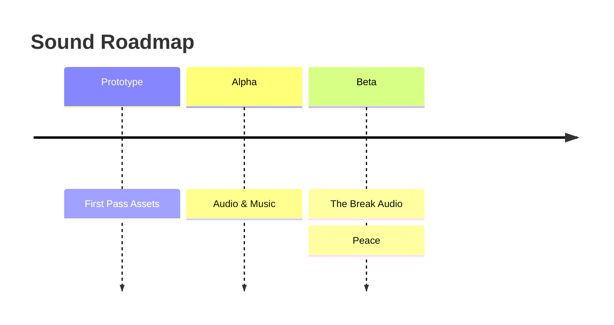

# Volley Vendetta - Sound Roadmap

## Prototype

**First Pass Assets** produces placeholder-quality-but-complete audio for the demo: hit sound, miss sound, streak milestone cue, partner intro sound, and a simple gameplay loop. Replaced in Alpha.

## Alpha

**Audio & Music** completes the sound design: hit variations, miss sounds, fanfares, partner motifs, main menu theme, and gameplay loops. Each partner should have something in the audio that reflects their personality.

## Beta

**The Break Audio** designs the audio treatment for the snap moment. Whether that's silence, a register shift, or something that makes the player feel the world change.

**Peace** covers the music and sound shift for post-game. The warmth of the main game is still present but settled.
