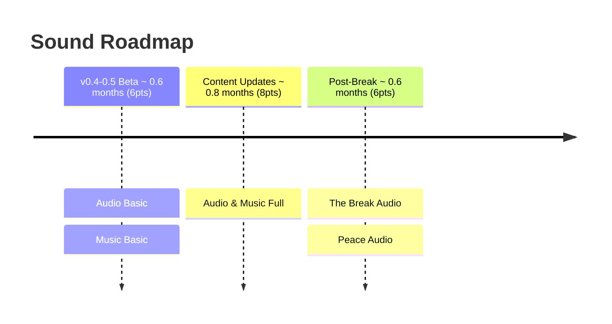

# Volley Vendetta - Sound Roadmap

**Total: ~2.0 months (20pts)**

## v0.4-0.5 Beta

**Audio Basic** covers the essential hit sounds, miss sounds, and the streak milestone audio cue. These are the sounds the player hears most; they need to feel satisfying from the first session.

**Music Basic** delivers the main menu theme and one gameplay loop. The gameplay loop will play for a long time at a stretch, so it needs to work as background texture without demanding attention.

## Content Updates

**Audio & Music Full** completes the sound design: fanfares, audio polish, character motifs per partner, and the remaining music tracks. Each partner should have something in the audio that reflects their personality. By the end of this phase the game should feel sonically finished.

## Post-Break

**The Break Audio** designs the audio treatment for the snap moment. Whether that's silence, a register shift, or something that makes the player feel the world change is a creative decision that follows from The Break Design brief. The audio here does more emotional work than anything else in the game.

**Peace Audio** covers the music and sound shift for the post-game state. The warmth of the main game is still present but settled, not constructed. Should feel earned rather than designed. A new piece or a recontextualisation of existing music.
