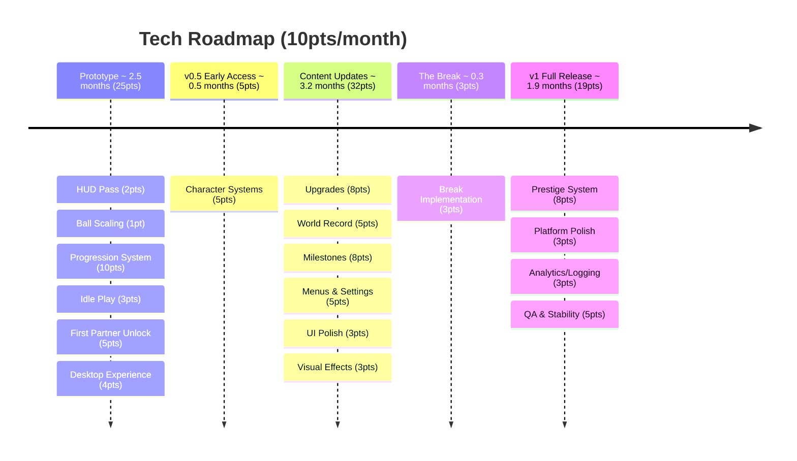

# Volley Vendetta - Tech Roadmap

## Prototype - 25pts

1. **HUD Pass** (2pts) - volley counter with reset on miss, high score display, VolleyTracker refactor
2. **Ball Scaling** (1pt) - ball speeds up during a streak, creating natural difficulty curve, paddle hit sound
3. **Progression System** (10pts) - earn FP from volleys, 3 upgrades (paddle speed, size, ball start speed), save/load persistence
4. **Idle Play** (3pts) - paddles play on their own when player isn't touching controls
5. **First Partner Unlock** (5pts) - spend FP to recruit your first partner, replaces the wall as an upgrade milestone
6. **Desktop Experience** (4pts) - borderless small window, always on top, minimal UI, Windows build

## v0.5 Early Access - 5pts

7. **Character Systems** (5pts) - paddle reactions, expressions, state machine for personality

## Content Updates - 32pts

8. **Upgrades** (8pts) - full upgrade tree implementation
9. **World Record** (5pts) - wire up partner abilities and dialogue, implement partner unlock flow
10. **Milestones** (8pts) - streak milestones, record milestones, collection UI, FP or narrative rewards on trigger
11. **Menus & Settings** (5pts) - pause menu, settings, volume, controls rebind
12. **UI Polish** (3pts) - HUD animations, streak indicators, score transitions
13. **Visual Effects** (3pts) - hit sparks, streak glow, miss reaction

## The Break - 3pts

14. **Break Implementation** (3pts) - trigger, transitions, wiring all Break disciplines together

## v1 Full Release - 19pts

15. **Prestige System** (8pts) - reset loop implementation, multipliers, post-prestige state
16. **Platform Polish** (3pts) - Linux export, window management
17. **Analytics/Logging** (3pts) - basic telemetry, display stats on itch page
18. **QA & Stability** (5pts) - bug fixes, optimisation, error handling

---
**Total: 84pts**
