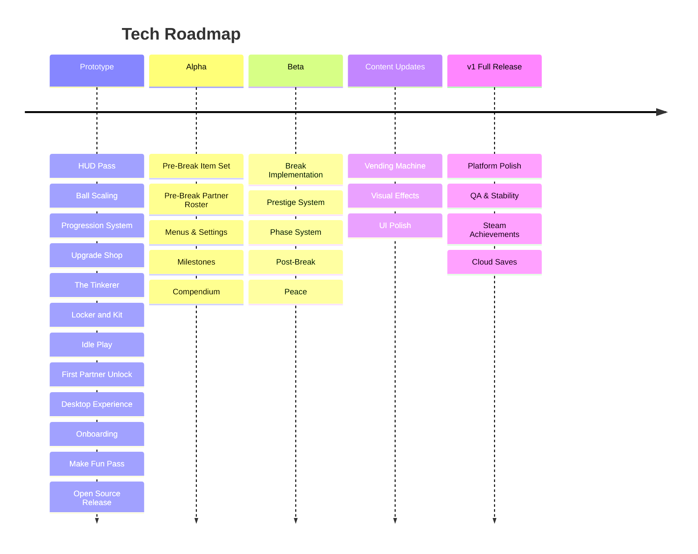

# Volley Vendetta - Tech Roadmap

## Prototype

**HUD Pass** refactors the VolleyTracker and wires up the volley counter with a reset on miss and a high score display.

**Ball Scaling** makes the ball speed up as a streak grows, creating a natural difficulty curve. Includes the paddle hit sound.

**Progression System** is the core economy: earning FP from volleys, items that make the paddle better, and save/load persistence.

**Upgrade Shop** implements the player-facing shop: a rotating selection of items the player can browse and purchase with FP.

**The Tinkerer** implements item levelling and item destruction.

**Locker and Kit** implements the item inventory system: equip items to active kit slots, passive FP from the locker.

**Idle Play** makes the paddles play on their own when the player isn't touching the controls.

**First Partner Unlock** lets the player spend FP to recruit Martha, adding a second paddle and the bark system.

**Desktop Experience** ships a borderless small window that sits always-on-top with minimal UI. Includes the scene layout: game as primary scene, panels (shop, kit, compendium) as secondary scenes that compress the game viewport.

**Onboarding** implements the first-run experience: gets the player into their first volley without a tutorial.

**Make Fun Pass** is a structured playtest and tuning pass. No new features; find what feels bad, fix it.

**Open Source Release** moves the project off personal accounts. Repo and itch.io transfer to the Shuck Games org, history scrubbed, preview builds working.

## Alpha

**Pre-Break Item Set** implements all pre-break pool items beyond the prototype set. Post-break items ship as part of the Post-Break Phase in Beta.

**Pre-Break Partner Roster** wires up partner effects, barks, and art for all pre-break partners. Each partner ships as a complete package. Post-break partners ship as part of the Post-Break Phase in Beta.

**Menus & Settings** covers the pause menu, settings screen, volume controls, and controls rebinding.

**Milestones** implements streak and record milestones, badges, the collection UI, and rewards.

**Compendium** implements the reference screen for mastered items and partners.

## Beta

**Break Implementation** wires the full break sequence together: the resistance mechanic, the cut to black, the fullscreen expansion, the reveal sequence, and the return to the game window.

**Prestige System** implements the reset loop and post-prestige state. Prestige triggers at each phase transition and runs continuously in post-game.

**Phase System** tracks which phase the player is in and routes the correct barks, art, and target number accordingly.

**Post-Break** implements the post-break state: shifted bark line sets, visual changes, post-break items and partners, the game continuing with the player knowing the truth.

**Peace** implements the post-game state: free play, palette change, music shift, continuous prestige. The story is over and the game is yours.

## Content Updates

**Vending Machine** implements consumable item purchases.

**Visual Effects** adds hit sparks, streak glow, and miss reactions.

**UI Polish** adds HUD animations, streak indicators, and score transitions.

## v1 Full Release

**Platform Polish** handles window management edge cases on Linux and Windows.

**QA & Stability** is a dedicated bug fixing, optimisation, and error handling pass.

**Steam Achievements** wires up the Steam achievement system.

**Cloud Saves** implements Steam cloud save sync.
