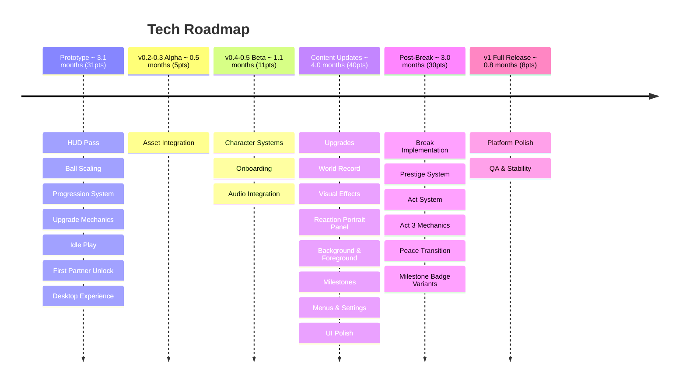

# Volley Vendetta - Tech Roadmap

**Total: ~12.5 months (125pts)**

## Prototype

**HUD Pass** refactors the VolleyTracker and wires up the volley counter with a reset on miss and a high score display. The numbers the player watches should always feel responsive and accurate.

**Ball Scaling** makes the ball speed up as a streak grows, creating a natural difficulty curve. Includes the paddle hit sound, the first piece of audio feedback in the game.

**Progression System** is the core economy: earning FP from volleys, three upgrades (paddle speed, paddle size, ball start speed), and save/load persistence. This is the largest prototype task and gates everything that follows. Done when upgrades survive a session close and reopen.

**Upgrade Mechanics** implements the mechanical effects of all upgrades per the design spec. Each tier must produce a change the player can feel. Tuned until the progression loop is satisfying before moving on; this is not just wiring, it is feel work.

**Idle Play** makes the paddles play on their own when the player isn't touching the controls. The game needs to be worth watching, not just worth playing.

**First Partner Unlock** lets the player spend FP to recruit their first partner, replacing the wall as the thing on the other side of the net. This is the first moment the game's cast exists in the world.

**Desktop Experience** ships a borderless small window that sits always-on-top with minimal UI, as a Windows build. Done when you can leave it on your desktop during a working session without it being intrusive.

## v0.2-0.3 Alpha

**Asset Integration** replaces all placeholder art with the assets delivered by Art: character sprites and expressions, idle/hit/miss animations, arena, and ball. Depends on Character Art and Character Animation being delivered first. Done when no placeholder assets remain in the running game.

## v0.4-0.5 Beta

**Character Systems** implements the paddle's personality layer: reactions, expressions, and a state machine that drives character behaviour in response to streaks, misses, and milestones. The paddle needs to feel like it has opinions.

**Onboarding** implements the first-run experience designed by Onboarding Design: how the game introduces itself, surfaces the dream, and gets the player into their first volley without a tutorial.

**Audio Integration** wires up the audio and music assets delivered by Sound: hit sounds, miss sounds, streak milestone cue, menu theme, and gameplay loop. Depends on Audio Basic and Music Basic being delivered first.

## Content Updates

**Upgrades** implements the full upgrade tree beyond the prototype's three: all tiers, all effects, wired to the economy.

**World Record** wires up partner abilities and dialogue and implements the partner unlock flow for the full roster. By the end of this task the game should have all partners recruitable and reactive.

**Visual Effects** adds hit sparks, streak glow, and miss reactions. These are the moment-to-moment feedback layer that makes the volley feel alive.

**Reaction Portrait Panel** implements the panel system that slides in when a partner reacts: triggers from character state, pulls the correct portrait crop, handles transitions. Depends on Reaction Portrait Panel art assets.

**Background & Foreground** implements the parallax layer system for the atmospheric depth art delivers. Handles scroll rates, layering, and performance.

**Milestones** implements streak milestones and record milestones, the collection UI, and the FP or narrative rewards that trigger on each one. Milestone numbers must match the values defined by writing; they encode The Event.

**Menus & Settings** covers the pause menu, settings screen, volume controls, and controls rebinding. The game should be controllable by someone who has never played it before.

**UI Polish** adds HUD animations, streak indicators, and score transitions. The difference between a game that feels finished and one that doesn't is usually here.

## Post-Break

**Break Implementation** wires the full Break sequence together: the resistance mechanic as the count approaches record-1, the cut to black, the fullscreen expansion, the reveal sequence, and the return to the game window. This task depends on all other Break disciplines being complete before it begins.

**Prestige System** implements the reset loop, multipliers, and post-prestige state for all three acts. The mechanical reset must produce different narrative states depending on which prestige the player is on: Act 1, 2, and 3 should feel distinct even if the loop is the same.

**Act System** tracks which act the player is in and routes the correct dialogue, art, and target number accordingly. Acts 1, 2, and 3 each have a different record target (record-1, record, past the record) and different narrative state. This system is what makes the prestige loop feel distinct across acts rather than just mechanical.

**Act 3 Mechanics** implements whatever Act 3 Mechanics Design specifies. Scope is undefined until that design is complete; this ticket is a placeholder that will be broken down once the design lands.

**Peace Transition** implements the shift to the Peace post-game state: applies the visual palette change, swaps to the Peace music track, and routes partner dialogue to the Peace writing pass. Depends on Peace Art, Peace Audio, and Peace Writing all being delivered.

**Milestone Badge Variants** wires up the art and text swapping for badges across acts. In Act 1 badges read as sports achievements. Post-Break they carry a second meaning. The system needs to serve both readings from the same badge collection.

## v1 Full Release

**Platform Polish** adds the Linux export and handles window management edge cases across platforms.

**QA & Stability** is a dedicated bug fixing, optimisation, and error handling pass before launch. Not a phase for new features.
