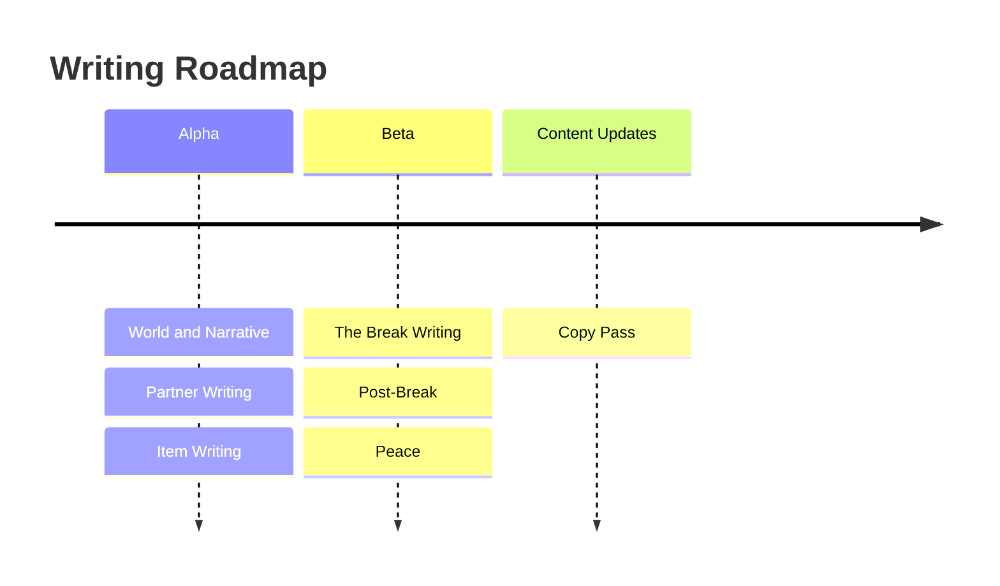

# Volley Vendetta - Writing Roadmap

Writing lands alongside the content it supports. Partner writing ships with each partner. Item writing ships with each item. There are no standalone writing deliverables that exist in isolation from the thing they describe.

## Alpha

**World and Narrative** establishes the underlying layer: lore, characters, setting, tone, and the shape of the clue ladder. Includes the high-level break design so Beta can implement without waiting. This is the foundational document that everything else in writing references.

**Partner Writing** ships with each pre-break partner: name, personality, backstory, barks (pre-break line sets), and bio. Each partner's ordinary name directly references a person who affected the main character in their reality. Post-break partners and post-break line sets ship in Beta.

**Item Writing** ships with each pre-break item: descriptions (default, power revealed, narrative revealed variants) and the Tinkerer's commentary. Post-break items ship in Beta.

## Beta

**The Break Writing** covers the reveal moment. One specific truth, clearly committed to. The highest-stakes writing in the game.

**Post-Break** covers the shifted bark line sets, post-break partner and item writing, and any changed copy. Same voices, different weight.

**Peace** covers partner barks and copy for the post-game state: warmer, quieter, settled.

## Content Updates

**Copy Pass** covers general in-game text, UI copy, and any remaining written content that needs polish.
