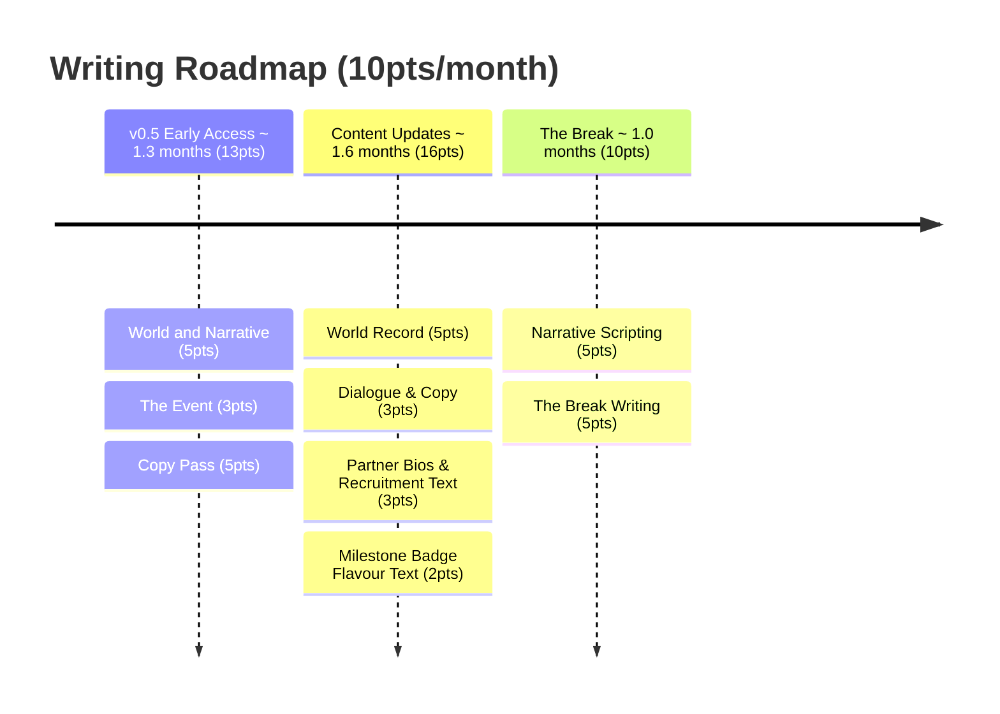

# Volley Vendetta - Writing Roadmap

## v0.5 Early Access - 14pts

1. **World and Narrative** (5pts) - lore, characters, setting, tone; establish the underlying narrative layer and clue ladder
2. **The Event** (3pts) - decide what actually happened; the real thing the game-world is a fiction for. Everything in The Break depends on this answer. Must be resolved before partner signal lines or the clue ladder can be written.
3. **Copy Pass** (5pts) - onboarding text, upgrade descriptions, and welcome back messages; all short-form copy that sets tone across the early game

## Content Updates - 16pts

6. **World Record** (5pts) - name, personality, backstory and abilities for 3-5 partners; establish the world record number
7. **Dialogue & Copy** (3pts) - general in-game text, UI copy, partner idle reactions
8. **Partner Bios & Recruitment Text** (3pts) - the moment you unlock a partner; name, bio, recruitment line per partner
9. **Milestone Badge Flavour Text** (2pts) - badge names and a line each; feeds Art and Tech milestone items

## The Break - 11pts

10. **Narrative Scripting** (5pts) - signal-layer dialogue per partner; the clue ladder executed in actual lines, written after World Record design lands
11. **The Break Writing** (5pts) - the reveal moment copy and the post-Break framing; what the player reads when the world changes and what they carry forward

---
**Total: 37pts**
