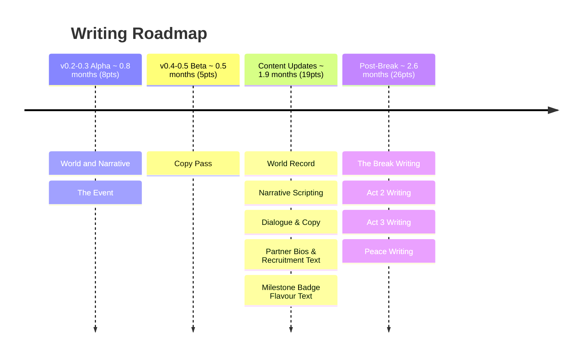

# Volley Vendetta - Writing Roadmap

**Total: ~5.8 months (58pts)**

## v0.2-0.3 Alpha

**World and Narrative** establishes the underlying layer: lore, characters, setting, tone, and the shape of the clue ladder. This is the foundational document that everything else in writing references. It doesn't produce in-game text; it produces the truth the in-game text has to conceal and reveal. Must be done before Art Direction begins.

**The Event** is the single most important writing decision in the game: what actually happened. The world record number, the partner identities, the signal lines, the milestone numbers, the reveal image; none of it can be finalised until this is decided. Everything downstream in writing is blocked until it lands. Should be resolved before Character Art begins so the artist knows who these people actually are.

## v0.4-0.5 Beta

**Copy Pass** writes the short-form copy that sets tone across the early game: onboarding text, upgrade descriptions, and welcome back messages. This is the player's first extended contact with the game's voice and should feel warm, earnest, and slightly too considered.

## Dialogue system tooling

The game has heavy dialogue requirements: Tinkerer destruction lines (one per item), synergy failure lines (~490 pairs), Shopkeeper entry dialogue that shifts across Act 1, partner banter, and the signal-layer clue ladder. Before Narrative Scripting begins, evaluate **Dialogic** (AssetLib) as the dialogue runtime. It handles branching dialogue, character portraits, timeline-based sequences, and conditional line selection, which maps well to the tier-gated and condition-based dialogue described in The Shopkeeper and the Tinkerer design. The alternative is a bespoke system, which may be simpler for this game's mostly single-line-per-trigger pattern but would need to be built.

---

## Content Updates

**World Record** writes the name, personality, backstory, and abilities for three to five partners, and establishes the world record number. The record number must encode The Event; it is not a round number and it is not arbitrary.

**Narrative Scripting** executes the clue ladder in actual lines: signal-layer dialogue per partner across all three stages, written once the World Record design has landed and the full partner roster is known. These lines live inside the Content Updates phase so they can be woven into partner dialogue as it is written, rather than retrofitted later.

**Dialogue & Copy** covers general in-game text, UI copy, and partner idle reactions, the ambient voice of the game between meaningful moments.

**Partner Bios & Recruitment Text** writes the unlock moment for each partner: name, bio, and the recruitment line the player sees when they first bring someone in. This is where partner personality is introduced.

**Milestone Badge Flavour Text** names each badge and gives it a line. In Act 1 these read as sports achievement text. After The Break they should mean something different without being changed. The writing needs to carry both readings.

## Post-Break

**The Break Writing** covers the reveal moment copy and the post-Break framing: what the player reads when the world changes, and what they carry forward. This is the highest-stakes writing in the game. The urge to over-explain will be strong. Resist it. One specific truth, clearly committed to, no hedging.

**Act 2 Writing** covers the full dialogue pass for Act 2: partners becoming less subtle, the rival softening, and the saviour emerging. The cozy framing is still present but straining. Lines should work as surface dialogue on first read and mean something different in context.

**Act 3 Writing** covers the Act 3 dialogue pass: the paddle honest, the rival as ally, milestones reframed as processing rather than achievement. Also includes Act 3 variants of milestone badge flavour text, which should carry the same words but land differently now the player knows the truth.

**Peace Writing** covers partner dialogue for the post-game state: warmer, quieter, settled. The earnestness is still there but no longer straining. Should feel like a version of the game that could only exist because of what came before.
